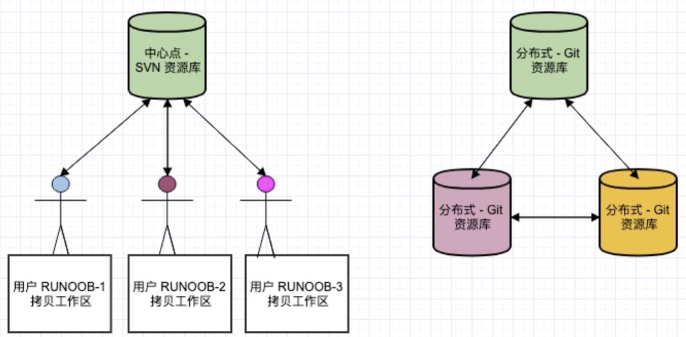
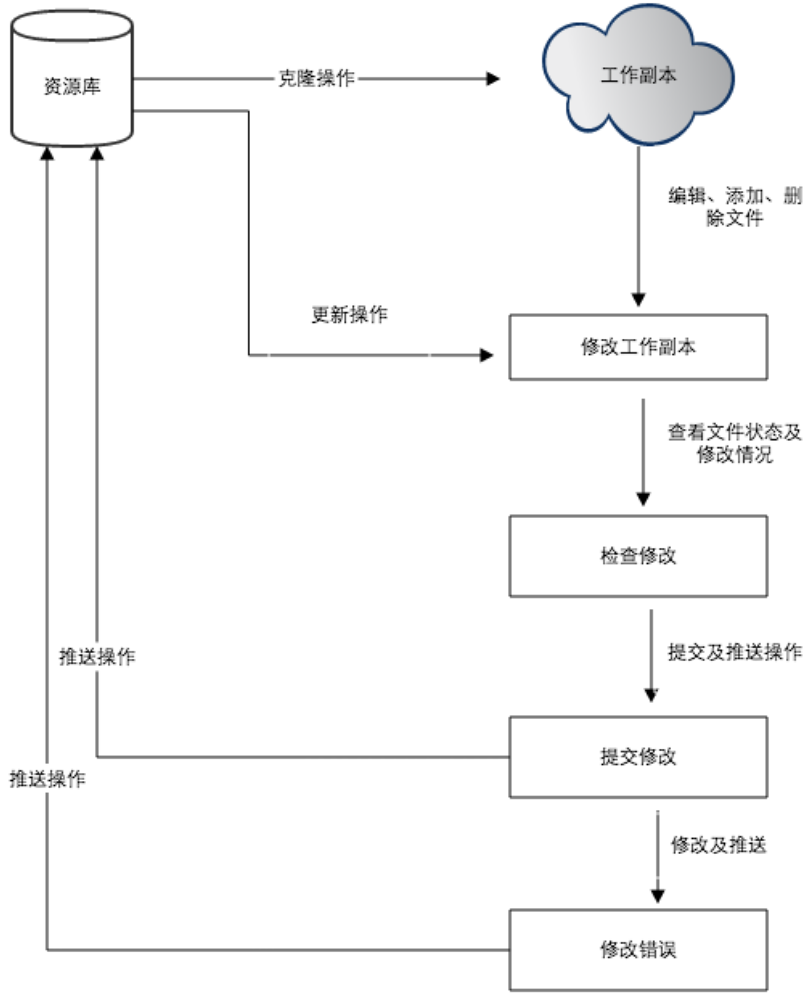

## git
Git 是一个开源的分布式版本控制系统，用于敏捷高效地处理任何或小或大的项目。

Git 是 Linus Torvalds 为了帮助管理 Linux 内核开发而开发的一个开放源码的版本控制软件。

## Git 与 SVN 区别
Git 不仅仅是个版本控制系统，它也是个内容管理系统(CMS)，工作管理系统等。


Git 与 SVN 区别点：
1. Git 是`分布式`的，SVN 不是：这是 Git 和其它非分布式的版本控制系统，例如 SVN，CVS 等，最核心的区别。
2. Git `把内容按元数据方式存储，而 SVN 是按文件`：所有的资源控制系统都是把文件的元信息隐藏在一个类似 .svn、.cvs 等的文件夹里。
3. Git 分支和 SVN 的`分支不同`：分支在 SVN 中一点都不特别，其实它就是版本库中的另外一个目录。
4. `Git 没有一个全局的版本号，而 SVN 有`：目前为止这是跟 SVN 相比 Git 缺少的最大的一个特征。
5. `Git 的内容完整性要优于 SVN`：Git 的内容存储使用的是 SHA-1 哈希算法。这能确保代码内容的完整性，确保在遇到磁盘故障和网络问题时降低对版本库的破坏。

## git工作流程
1. 克隆 Git 资源作为工作目录。`git clone`
2. 在克隆的资源上添加或修改文件。`git add ==> git commit`
3. 如果其他人修改了，你可以更新资源。`git pull == git rebase`
4. 在提交前查看修改。`git diff`
5. 提交修改。`git push origin master`
    - 一般origin默认为你clone的Repositories,也可以自定义远程服务器别名origin: git remote add origin git@github.com:xxx/xxxx.git
6. 在修改完成后，如果发现错误，可以撤回提交并再次修改并提交。
    - 修改之前的某次注释: git rebase -i HEAD~2 (最后的数字2指的是显示到倒数第几次 比如这个输入的2就会显示倒数的两次注释)

)

## git 命令
1. 基础命令
    - 初始化：git init
    - 添加：git add 文件名。把某一文件添加到git仓库中
    - 提交：git commit -m '文件描述'。把添加的文件提交到仓库
    - 查看状态：git status。查看仓库当前的状态
    - 查看文件提交信息：git diff 。显示已写入缓存与已修改但尚未写入缓存的改动的区别
    - 取消已经缓存的内容：git reset HEAD
    - 删除文件：git rm 文件名从。 Git 中移除某个文件
    - 删除文件：git rm -f 文件名。 删除之前修改过并且已经提交的文件
    - 查看提交日志： git log。显示从最近到最远的提交日志
    - 查看命令历史：git reflog
2. 远程命令
    - 添加远程仓库：git remote add origin [git地址]
    - 提交：git push origin master 把本地的master分支的最新修改推送到远程仓库
    - 克隆：git clone URL。地址把远程仓库克隆到本地
3. 分支命令
    - 创建分支：git branch 分支名
    - 切换分支：git checkout 分支名或者git switch 分支名
    - 合并分支：git merge 分支名
      - 开发分支（dev）上的代码达到上线的标准后，要合并到 master 分支
        ```bash
        git checkout dev
        git pull
        git checkout master
        git merge dev
        git push -u origin master
        ```
    - 合并分支：git rebase。rebase 实际上就是取出一系列的提交记录，“复制”它们，然后在另外一个地方逐个的放下去。
        ```bash
        #提交一次(提交在master分支上)
        git commit
        # 切换到bugFix分支
        git checkout bugFix
        #  提交一次（提交在bugFix分支上）
        git commit
        #使用git rebase把 bugFix 分支里的工作直接移到 master 分支上（移动以后会使得两个分支的功能看起来像是按顺序开发，但实际上它们是并行开发#的）。
        git rebase master
        #切换到master分支上（为了进行更新master的操作）
        git checkout master
        #把master的 rebase 到 bugFix 分支上（由于 bugFix 继承自 master，所以 git 只是简单的把 master 分支的引用向前移动了一下而已。）
        git rebase bugFix
        ```
    - 删除分支：git branch -d 分支名
4. 标签管理
    - 创建标签：git tag 标签名
    - 查看所有标签：git tag
    - 推送标签：git push origin 标签名
    - 删除标签：git tag -d 标签名

## Git 工作区、暂存区和版本库
- 工作区：就是你在电脑里能看到的目录。
- 暂存区：英文叫 stage 或 index。一般存放在 .git 目录下的 index 文件（.git/index）中，所以我们把暂存区有时也叫作索引（index）。
- 版本库：工作区有一个隐藏目录 .git，这个不算工作区，而是 Git 的版本库。
  

- 图中左侧为工作区，右侧为版本库。在版本库中标记为 "index" 的区域是暂存区（stage/index），标记为 "master" 的是 master 分支所代表的目录树。
- 图中我们可以看出此时 "HEAD" 实际是指向 master 分支的一个"游标"。所以图示的命令中出现 HEAD 的地方可以用 master 来替换。
- 图中的 objects 标识的区域为 Git 的对象库，实际位于 ".git/objects" 目录下，里面包含了创建的各种对象及内容。
- 当对工作区修改（或新增）的文件执行 git add 命令时，暂存区的目录树被更新，同时工作区修改（或新增）的文件内容被写入到对象库中的一个新的对象中，而该对象的ID被记录在暂存区的文件索引中。
- 当执行提交操作（git commit）时，暂存区的目录树写到版本库（对象库）中，master 分支会做相应的更新。即 master 指向的目录树就是提交时暂存区的目录树。
- 当执行 git reset HEAD 命令时，暂存区的目录树会被重写，被 master 分支指向的目录树所替换，但是工作区不受影响。
- 当执行 git rm --cached \<file> 命令时，会直接从暂存区删除文件，工作区则不做出改变。
- 当执行 git checkout . 或者 git checkout -- \<file> 命令时，会用暂存区全部或指定的文件替换工作区的文件。这个操作很危险，会清除工作区中未添加到暂存区中的改动。
- 当执行 git checkout HEAD . 或者 git checkout HEAD <file> 命令时，会用 HEAD 指向的 master 分支中的全部或者部分文件替换暂存区和以及工作区中的文件。这个命令也是极具危险性的，因为不但会清除工作区中未提交的改动，也会清除暂存区中未提交的改动。