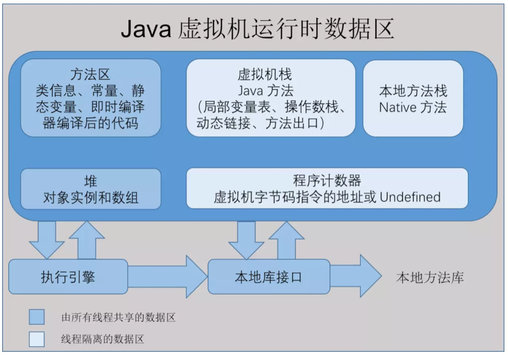

# java-JVM

## 概念

JVM是Java Virtual Machine（Java虚拟机）的缩写，JVM是一种用于计算设备的规范，它是一个虚构出来的计算机，是通过在实际的计算机上仿真模拟各种计算机功能来实现的。

引入Java语言虚拟机后，Java语言在不同平台上运行时不需要重新编译。Java语言使用Java虚拟机屏蔽了与具体平台相关的信息，使得Java语言编译程序只需生成在Java虚拟机上运行的目标代码（字节码），就可以在多种平台上不加修改地运行。

`Java虚拟机有自己完善的硬件架构，如处理器、堆栈等，还具有相应的指令系统`。

Java虚拟机本质上就是一个程序，当它在命令行上启动的时候，就开始执行保存在某字节码文件中的指令。Java语言的可移植性正是建立在Java虚拟机的基础上。任何平台只要装有针对于该平台的Java虚拟机，字节码文件（.class）就可以在该平台上运行。这就是“`一次编译，多次运行`”。

Java虚拟机不仅是一种跨平台的软件，而且是一种新的网络计算平台。该平台包括许多相关的技术，如符合开放接口标准的各种API、优化技术等。Java技术使同一种应用可以运行在不同的平台上。Java平台可分为两部分，即Java虚拟机（Java virtual machine，JVM）和Java API类库。(`Java平台=Java API + Java类库`)

## Java 内存区域

1. 程序计数器:

    内存空间小，线程私有。字节码解释器工作是就是通过改变这个计数器的值来选取下一条需要执行指令的字节码指令，分支、循环、跳转、异常处理、线程恢复等基础功能都需要依赖计数器完成。
2. Java 虚拟机栈:

    线程私有，生命周期和线程一致。描述的是 Java 方法执行的内存模型：每个方法在执行时都会床创建一个栈帧(Stack Frame)用于存储局部变量表、操作数栈、动态链接、方法出口等信息。每一个方法从调用直至执行结束，就对应着一个栈帧从虚拟机栈中入栈到出栈的过程。
3. 本地方法栈:

    区别于 Java 虚拟机栈的是，Java 虚拟机栈为虚拟机执行 Java 方法(也就是字节码)服务，而本地方法栈则为虚拟机使用到的 Native 方法服务。也会有 StackOverflowError 和 OutOfMemoryError 异常。
4. Java 堆
5. 方法区

