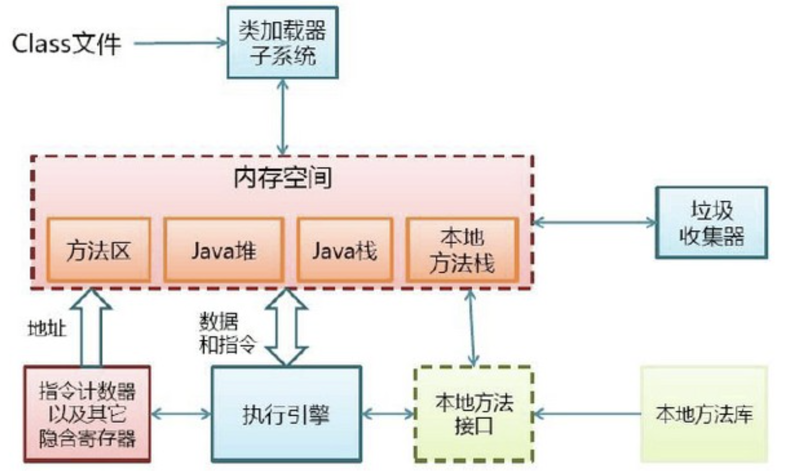
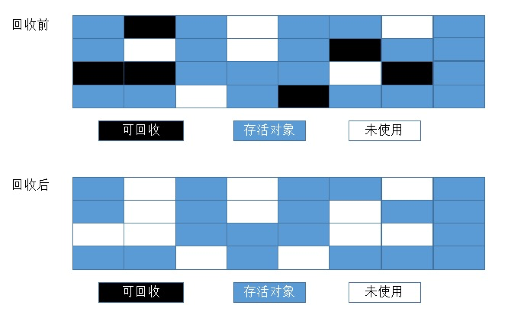
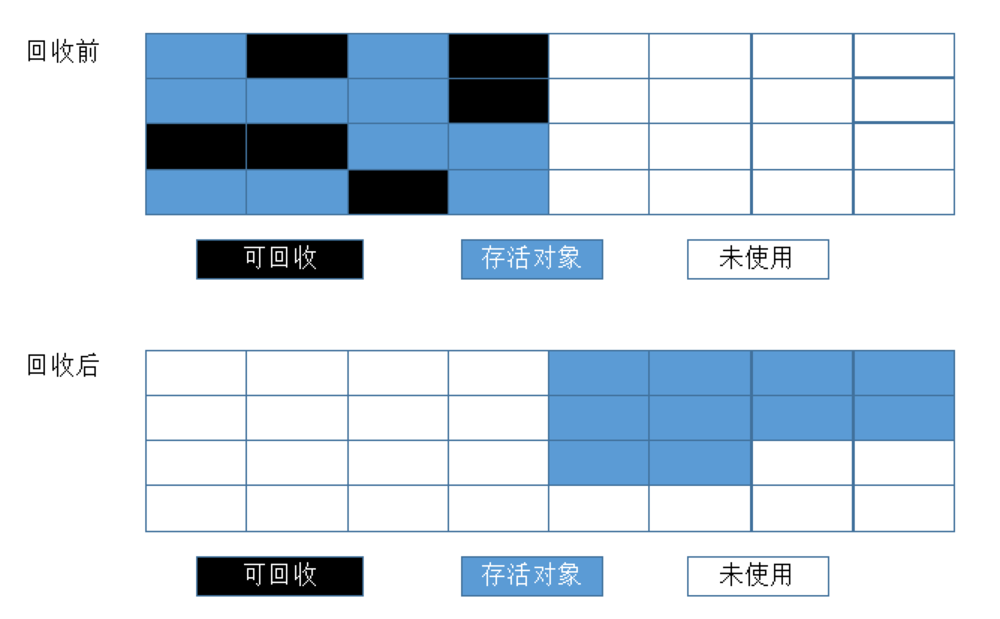
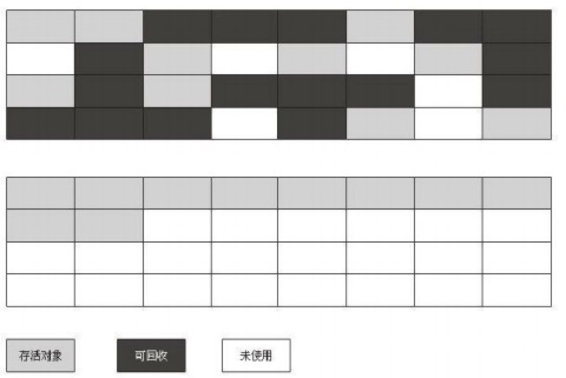
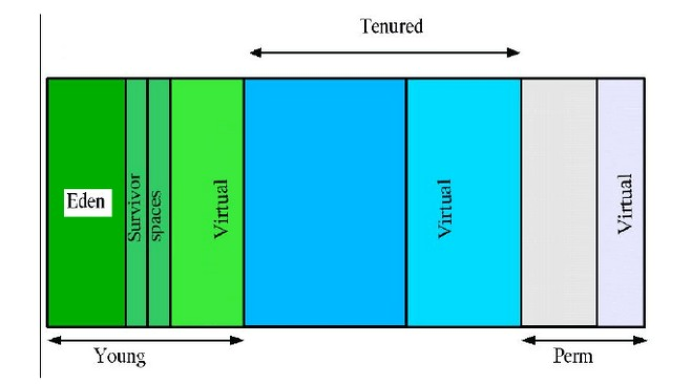
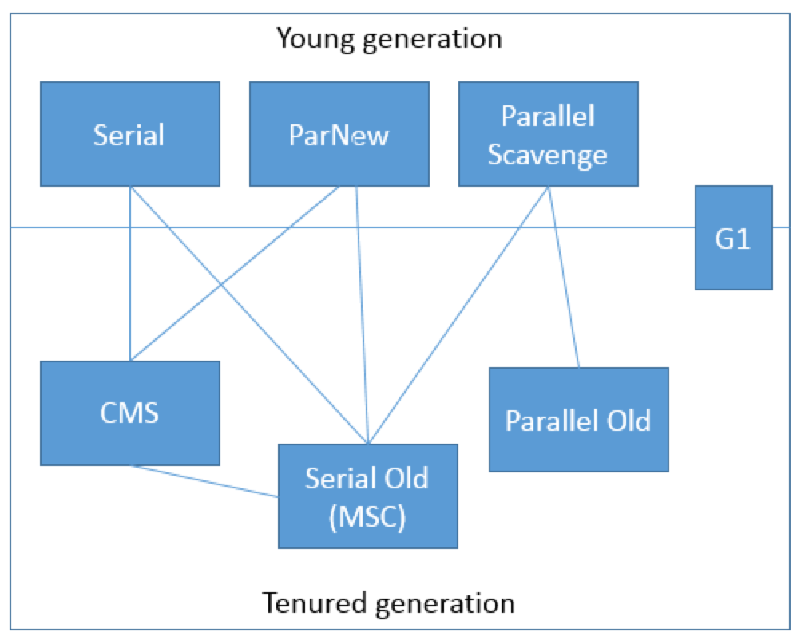

# java-JVM

## 概念

JVM是Java Virtual Machine（Java虚拟机）的缩写，JVM是一种用于计算设备的规范，它是一个虚构出来的计算机，是通过在实际的计算机上仿真模拟各种计算机功能来实现的。

引入Java语言虚拟机后，Java语言在不同平台上运行时不需要重新编译。Java语言使用Java虚拟机屏蔽了与具体平台相关的信息，使得Java语言编译程序只需生成在Java虚拟机上运行的目标代码（字节码），就可以在多种平台上不加修改地运行。

`Java虚拟机有自己完善的硬件架构，如处理器、堆栈等，还具有相应的指令系统`。

Java虚拟机本质上就是一个程序，当它在命令行上启动的时候，就开始执行保存在某字节码文件中的指令。Java语言的可移植性正是建立在Java虚拟机的基础上。任何平台只要装有针对于该平台的Java虚拟机，字节码文件（.class）就可以在该平台上运行。这就是“`一次编译，多次运行`”。

Java虚拟机不仅是一种跨平台的软件，而且是一种新的网络计算平台。该平台包括许多相关的技术，如符合开放接口标准的各种API、优化技术等。Java技术使同一种应用可以运行在不同的平台上。Java平台可分为两部分，即Java虚拟机（Java virtual machine，JVM）和Java API类库。(`Java平台=Java API + Java类库`)

## Java 内存区域

1. 程序计数器:

    内存空间小，线程私有(线程创建时被分配)。字节码解释器工作是就是通过改变这个计数器的值来选取下一条需要执行指令的字节码指令，分支、循环、跳转、异常处理、线程恢复等基础功能都需要依赖计数器完成。
2. Java 虚拟机栈:

    线程私有，生命周期和线程一致。描述的是 Java 方法执行的内存模型：每个方法在执行时都会床创建一个栈帧(Stack Frame)用于存储局部变量表、操作数栈、动态链接、方法出口等信息。每一个方法从调用直至执行结束，就对应着一个栈帧从虚拟机栈中入栈到出栈的过程。Java堆栈保存了一个线程调用方法时的状态，包括本地变量、调用方法的 参数、返回值、处理的中间变量。
3. 本地方法栈:

    调用本地方法（一个java调用非java代码的接口。）时的状态保存在本地方法堆栈中（native method stacks），可能在寄存器或者其他非平台独立的内存中。区别于 Java 虚拟机栈的是，Java 虚拟机栈为虚拟机执行 Java 方法(也就是字节码)服务，而本地方法栈则为虚拟机使用到的 Native 方法服务。也会有 StackOverflowError 和 OutOfMemoryError 异常。
4. Java 堆
    当Java程序创建一个类的实例或者数组时，都在堆中为新的对象分配内存。`虚拟机中只有一个堆，所有的线程都共享他`。
    - 垃圾收集（Garbage Collection）
    `垃圾收集是释放没有被引用的对象的主要方法`。它也可能会为了减少堆的碎片，而移动对象。在Java虚拟机的规范中没有严格定义垃圾收集，只是定义一个Java虚拟机的实现必须通过某种方式管理自己的堆。

    - 对象存储结构（Object Representation）
    Java虚拟机的规范中没有定义对象怎样在堆中存储。每一个对象主要存储的是他的类和父类中定义的对象变量。对于给定的对象的引用，虚拟机必须嫩耨很快的 定位到这个对象的数据。另为，必须提供一种通过对象的引用方法对象数据的方法，比如方法区中的对象的引用，所以一个对象保存的数据中往往含有一个某种形式 指向方法区的指针。

    - 数组的保存（Array Representation）
    在Java 中，`数组是一种完全意义上的对象，他和对象一样保存在堆中、有一个指向Class类实例的引用`。所有同一维度和类型的数组拥有同样的Class，数组的长度不做考虑。对应Class的名字表示为维度和类型。比如一个整型数据的Class为“[I”，字节型三维数组Class名为“[[[B”，两维对象数据 Class名为“[[Ljava.lang.Object”。
    数组必须在堆中保存数组的长度、数组的数据和一些对象数组类型数据的引用。通过一个数组引用的，虚拟机应该能够取得一个数组的长度，通过索引能够访问特定的数据，能够调用Object定义的方法。Object是所有数据类的直接父类。

5. 方法区
    在Java虚拟机中，`被加载的类型信息都保存在方法区中`。这些信息在内存中的组织形式由虚拟机的实现者定义，比如，虚拟机工作在一个“little- endian”的处理器上，他就可以将信息保存为“little-endian”格式的，即使在Java类文件中他们是以“big-endian”格式保存的。设计者可以用最适合机器的表示格式来存储数据，以保证程序能够以最快的速度执行。但是，在一个只有很小内存的设备上，虚拟机的实现者就不会占用很大的内存。
    `程序中的所有线程共享一个方法区，所以访问方法区信息的方法必须是线程安全的`。如果你有两个线程都去加载一个叫Lava的类，那只能由一个线程被容许去加载这个类，另一个必须等待。
    在程序运行时，方法区的大小是可变的，程序在运行时可以扩展。有些Java虚拟机的实现也可以通过参数也订制方法区的初始大小，最小值和最大值。
    方法区也可以被垃圾收集。因为程序中的内由类加载器动态加载，所有类可能变成没有被引用（unreferenced）的状态。当类变成这种状态时，他就可能被垃圾收集掉。没有加载的类包括两种状态，一种是真正的没有加载，另一个种是“unreferenced”的状态。
    方法区存储`类`、`常量`、`JIT即时编译的方法代码`、`类加载信息的引用`等等。
    - 类型信息（Type Information）：
        每一个被加载的类型，在Java虚拟机中都会在方法区中保存：类型的全名、类型的父类型的全名、类型是一个类还是接口、类型的修饰符、所有父接口全名的列表。类型全名保存的数据结构由虚拟机实现者定义。

    - 方法列表：
        为了更有效的访问所有保存在方法区中的数据，这些数据的存储结构必须经过仔细的设计。所有方法区中，`除了保存了上边的那些原始信息外，还有一个为了加快存取速度而设计的数据结构，比如方法列表`。每一个被加载的非抽象类，Java虚拟机都会为他们产生一个方法列表，这个列表中保存了这个类可能调用的所有实例方法的引用，报错那些父类中调用的方法。

JMM约定将内存划分为工作区和公共内存数据区域。工作区为线程私有，基本类型数据和对象引用的地址存储在工作区。`当需要对内存区域的数据进行读写时,复制到工作区，修改完成后刷新到内存区供其他线程使用`。这其中可能会产生数据不一致性的问题，使用Volatile和synchronized以及锁等机制来保证。编码规则，需要注意原子性、可见性、有序性。JVM是对于JMM约定的具体实现方法，将内存分为五个部分，方法区、堆、JVM栈、本地方法栈、程序计数器。前两者属于线程共有，后三者属于线程私有。

- 方法区存储类、常量、JIT即时编译的方法代码，类加载信息的引用等等。
- 堆存储对象。
- JVM栈主要由方法栈帧组成，栈帧包含方法内的局部变量，操作数栈、动态链接和出口地址。
- 本地方法是JVM本身运行的方法和调用其他语言的区域。
- 程序计数器记录线程执行的地址，方便线程切换。

## Java GC

GC是垃圾收集的意思，忘记或者错误的内存回收会导致程序或系统的不稳定甚至崩溃，Java提供的GC功能可以`自动监测对象是否超过作用域`从而达到自动回收内存的目的，Java语言没有提供释放已分配内存的显示操作方法。Java程序员不用担心内存管理，因为垃圾收集器会自动进行管理。要请求垃圾收集，可以调用下面的方法之一:System.gc() 或Runtime.getRuntime().gc(),虽然调用这两个方法，但真正的GC操作时机，还是JVM自己判断，只做提示作用。

### GC对象的选取

1. 引用计数法：这种算法不能解决对象之间相互引用的情况，所以这种方法不靠谱
2. `可达性分析法`：这个算法的基本思想是通过一系列称为“GC Roots”的对象作为起始点，从这些节点向下搜索，搜索所走过的路径称为引用链，`当一个对象到GC Roots没有任何引用链`（即GC Roots到对象不可达）时，则证明此对象是不可用的。
    - GCRoots对象的选取：
        - 虚拟机栈（栈帧中的局部变量区，也叫做局部变量表）中引用的对象。
        - 本地方法栈中JNI(Native方法)引用的对象。
        - 方法区中的类静态属性引用的对象。
        - 方法区中常量引用的对象。

### 方法区的GC

方法区的垃圾回收主要回收两部分内容：

- 废弃常量
以字面量回收为例，如果一个字符串“abc”已经进入常量池，但是当前系统没有任何一个String对象引用了叫做“abc”的字面量，那么，如果发生垃圾回收并且有必要时，“abc”就会被系统移出常量池。常量池中的其他类（接口）、方法、字段的符号引用也与此类似。
- 无用的类

  - 该类的所有实例都已经被回收，即`Java堆中不存在该类的任何实例`。
  - 加载该类的`ClassLoader已经被回收`。
  - 该类对应的java.lang.Class`对象没有在任何地方被引用，无法在任何地方通过反射访问该类的方法`。

### 垃圾收集算法

1. 标记-清除（Mark-Sweep）算法:
标记-清除算法就如同它的名字样，分为“标记”和“清除”两个阶段：首先标记出所有需要回收的对象，标记完成后统一回收所有被标记的对象。这种算法的`不足主要体现在效率和空间`，从效率的角度讲，标记和清除两个过程的效率都不高；从空间的角度讲，标记清除后会产生大量不连续的内存碎片， 内存碎片太多可能会导致以后程序运行过程中在需要分配较大对象时，无法找到足够的连续内存而不得不提前触发一次垃圾收集动作。

2. 复制（Copying）算法:
复制算法是为了解决效率问题而出现的，它将可用的内存分为两块，每次只用其中一块，当这一块内存用完了，就将还存活着的对象复制到另外一块上面，然后再把已经使用过的内存空间一次性清理掉。这样每次只需要对整个半区进行内存回收，内存分配时也不需要考虑内存碎片等复杂情况，只需要移动指针，按照顺序分配即可。缺点是内存缩小为了原来的一半，这样代价太高了。现在的商用虚拟机都采用这种算法来回收新生代，不过研究表明1:1的比例非常不科学，因此`新生代的内存被划分为一块较大的Eden空间和两块较小的Survivor空间`，每次使用Eden和其中一块Survivor。每次回收时，将Eden和Survivor中还存活着的对象一次性复制到另外一块Survivor空间上，最后清理掉Eden和刚才用过的Survivor空间。

3. 标记-整理（Mark-Compact）算法:
复制算法在对象存活率较高的场景下要进行大量的复制操作，效率很低。万一对象100%存活，那么需要有额外的空间进行分配担保。老年代都是不易被回收的对象，对象存活率高，因此一般不能直接选用复制算法。根据老年代的特点，有人提出了另外一种标记-整理算法，过程与标记-清除算法一样，不过不是直接对可回收对象进行清理，而是让所有存活对象都向一端移动，然后直接清理掉边界以外的内存。

### JVM内存回收

垃圾回收原理是这样的：把对象分为年青代(Young)、年老代(Tenured)、持久代(Perm)，对不同生命周期的对象使用不同的算法。

1. Young（年轻代）
年轻代分三个区。一个`Eden区，两个Survivor区`。大部分对象在Eden区中生成。当Eden区满时，还存活的对象将被复制到Survivor区（两个中的一个），当这个Survivor区满时，此区的存活对象将被复制到另外一个Survivor区，当这个Survivor去也满了的时候，从第一个Survivor区复制过来的并且此时还存活的对象，将被复制年老区(Tenured。需要注意，Survivor的两个区是对称的，没先后关系，所以同一个区中可能同时存在从Eden复制过来对象，和从前一个Survivor复制过来的对象，而复制到年老区的只有从第一个Survivor去过来的对象。而且，Survivor区总有一个是空的。

2. Tenured（年老代）
年老代`存放从年轻代存活的对象`。一般来说年老代存放的都是生命期较长的对象。

3. Perm（持久代）
用于`存放静态文件，如今Java类、方法`等。持久代对垃圾回收没有显著影响，但是有些应用可能动态生成或者调用一些class，例如Hibernate等，在这种时候需要设置一个比较大的持久代空间来存放这些运行过程中新增的类。持久代大小通过-XX:MaxPermSize=进行设置。

当在程序中生成对象时，正常对象会在年轻代中分配空间，如果是过大的对象也可能会直接在年老代生成。年轻代在空间被分配完的时候就会发起内存回收，大部分内存会被回收，一部分幸存的内存会被拷贝至Survivor的from区，经过多次回收以后如果from区内存也分配完毕，就会也发生内存回收然后将剩余的对象拷贝至to区。等到to区也满的时候，就会再次发生内存回收然后把幸存的对象拷贝至年老区。`通常我们说的JVM内存回收总是在指堆内存回收`，确实只有堆中的内容是动态申请分配的，所以以上对象的年轻代和年老代都是指的JVM的Heap空间，而持久代则是之前提到的MethodArea，不属于Heap。

### 垃圾收集器

没有最好的垃圾收集器，更加没有万能的收集器，只能选择对具体应用最合适的收集器。这也是HotSpot为什么要实现这么多收集器的原因。不同虚拟机所提供的垃圾收集器可能会有很大差别，我们使用的是HotSpot，HotSpot这个虚拟机所包含的所有收集器如下所示。连线表示收集器之间相互配合工作。

1. Serial收集器
最基本、发展历史最久的收集器，这个收集器是一个`采用复制算法的单线程的收集器`。单线程一方面意味着它只会使用一个CPU或一条线程去完成垃圾收集工作，另一方面也意味着它`进行垃圾收集时必须暂停其他线程的所有工作`，直到它收集结束为止。后者意味着，在用户不可见的情况下要把用户正常工作的线程全部停掉，这对很多应用是难以接受的。不过实际上到目前为止，Serial收集器依然是虚拟机运行在Client模式下的默认新生代收集器，因为它简单而高效。用户桌面应用场景中，分配给虚拟机管理的内存一般来说不会很大，收集几十兆甚至一两百兆的新生代停顿时间在几十毫秒最多一百毫秒，只要不是频繁发生，这点停顿是完全可以接受的。

2. ParNew收集器
ParNew收集器其实就是`Serial收集器的多线程版本`，除了使用多条线程进行垃圾收集外，其余行为和Serial收集器完全一样，包括使用的也是`复制算法`。ParNew收集器除了多线程以外和Serial收集器并没有太多创新的地方，但是它却是Server模式下的虚拟机首选的新生代收集器，其中有一个很重要的和性能无关的原因是，`除了Serial收集器外，目前只有它能与CMS收集器配合工作`（看图）。ParNew收集器在单CPU的环境中绝对不会有比Serial收集器更好的效果，甚至由于线程交互的开销，该收集器在两个CPU的环境中都不能百分之百保证可以超越Serial收集器。当然，随着可用CPU数量的增加，它对于GC时系统资源的有效利用还是很有好处的。它默认开启的收集线程数与CPU数量相同，在CPU数量非常多的情况下，可以使用-XX:ParallelGCThreads参数来限制垃圾收集的线程数。

3. Parallel Scavenge收集器
Parallel Scavenge收集器也是一个新生代收集器，也是用`复制算法`的收集器，也是并行的`多线程收集器`，但是它的特点是它的关注点和其他收集器不同。介绍这个收集器主要还是介绍吞吐量的概念。
CMS等收集器的关注点是尽可能缩短垃圾收集时用户线程的停顿时间，而`Parallel Scavenge收集器的目标则是达到一个可控制的吞吐量`。所谓吞吐量的意思就是CPU用于运行用户代码时间与CPU总消耗时间的比值，即吞吐量=运行用户代码时间/（运行用户代码时间+垃圾收集时间），虚拟机总运行100分钟，垃圾收集1分钟，那吞吐量就是99%。另外，Parallel Scavenge收集器是虚拟机运行在Server模式下的默认垃圾收集器。`停顿时间短适合需要与用户交互的程序，良好的响应速度能提升用户体验`；`高吞吐量则可以高效率利用CPU时间，尽快完成运算任务`，主要适合在后台运算而不需要太多交互的任务。
虚拟机提供了-XX:MaxGCPauseMillis和-XX:GCTimeRatio两个参数来精确控制最大垃圾收集停顿时间和吞吐量大小。不过不要以为前者越小越好，`GC停顿时间的缩短是以牺牲吞吐量和新生代空间换取的`。由于与吞吐量关系密切，Parallel Scavenge收集器也被称为“吞吐量优先收集器”。
4. Serial Old收集器
Serial收集器的老年代版本，同样是一个`单线程收集器，使用“标记-整理算法”`，这个收集器的主要意义也是在于给Client模式下的虚拟机使用。

5. Parallel Old收集器
Parallel Scavenge收集器的老年代版本，使用`多线程和“标记-整理”`算法。这个收集器在JDK 1.6之后的出现，“吞吐量优先收集器”终于有了比较名副其实的应用组合，在注重吞吐量以及CPU资源敏感的场合，都可以优先考虑Parallel Scavenge收集器 + Parallel Old收集器的组合。

6. CMS收集器
CMS收集器是一款几乎可以认为有划时代意义的垃圾收集器，因为它第一次实现了让垃圾收集线程与用户线程基本上同时工作。CMS（Conrrurent Mark Sweep）收集器是`以获取最短回收停顿时间为目标的收集器`。其可能会有以下几个缺点：

   - 对CPU资源非常敏感，可能会导致应用程序变慢，吞吐率下降。
   - 无法处理浮动垃圾，因为在并发清理阶段用户线程还在运行，自然就会产生新的垃圾，而在此次收集中无法收集他们，只能留到下次收集，这部分垃圾为浮动垃圾，同时，由于用户线程并发执行，所以需要预留一部分老年代空间提供并发收集时程序运行使用。
   - 由于采用的标记 - 清除算法，会产生大量的内存碎片，不利于大对象的分配，可能会提前触发一次Full GC。
使用标记 - 清除算法，收集过程分为如下四步：
    1. 初始标记，标记GCRoots能直接关联到的对象，时间很短。
    2. 并发标记，进行GCRoots Tracing（可达性分析）过程，时间很长。
    3. 重新标记，修正并发标记期间因用户程序继续运作而导致标记产生变动的那一部分对象的标记记录，时间较长。
    4. 并发清除，回收内存空间，时间很长。

7. G1收集器
G1算法`将堆划分为若干个区域（Region）`，它仍然属于分代收集器。不过，这些区域的一部分包含新生代，`新生代的垃圾收集依然采用暂停所有应用线程的方式，将存活对象拷贝到老年代或者Survivor空间`。`老年代也分成很多区域，G1收集器通过将对象从一个区域复制到另外一个区域，完成了清理工作`。这就意味着，在正常的处理过程中，G1完成了堆的压缩（至少是部分堆的压缩），这样也就不会有cms内存碎片问题的存在了。
在G1中，还有一种特殊的区域，叫`Humongous区域`。 如果一个对象占用的空间超过了分区容量50%以上，G1收集器就认为这是一个巨型对象。这些巨型对象，默认直接会被分配在年老代，但是如果它是一个短期存在的巨型对象，就会对垃圾收集器造成负面影响。为了解决这个问题，G1划分了一个Humongous区，它用来专门存放巨型对象。如果一个H区装不下一个巨型对象，那么G1会寻找连续的H分区来存储。为了能找到连续的H区，有时候不得不启动Full GC。
G1主要有以下特点：
   - `并行和并发`。使用多个CPU来缩短Stop The World停顿时间，与用户线程并发执行。
   - `分代收集`。独立管理整个堆，但是能够采用不同的方式去处理新创建对象和已经存活了一段时间、熬过多次GC的旧对象，以获取更好的收集效果。
   - `空间整合`。基于标记 - 整理算法，无内存碎片产生。
   - `可预测的停顿`。通过可预测的停顿时间模型，能让使用者明确指定在一个长度为M毫秒的时间片段内，消耗在垃圾收集上的时间不得超过N毫秒。

    在G1之前的垃圾收集器，收集的范围都是整个新生代或者老年代，而G1不再是这样。`使用G1收集器时，Java堆的内存布局与其他收集器有很大差别，它将整个Java堆划分为多个大小相等的独立区域（Region）`，虽然还保留有新生代和老年代的概念，但新生代和老年代不再是物理隔离的了，它们都是一部分（可以不连续）Region的集合。