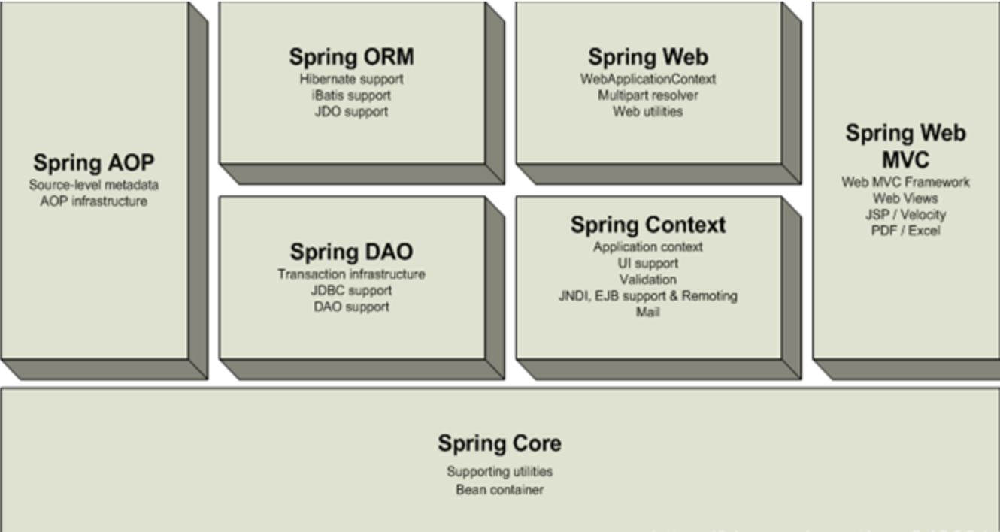
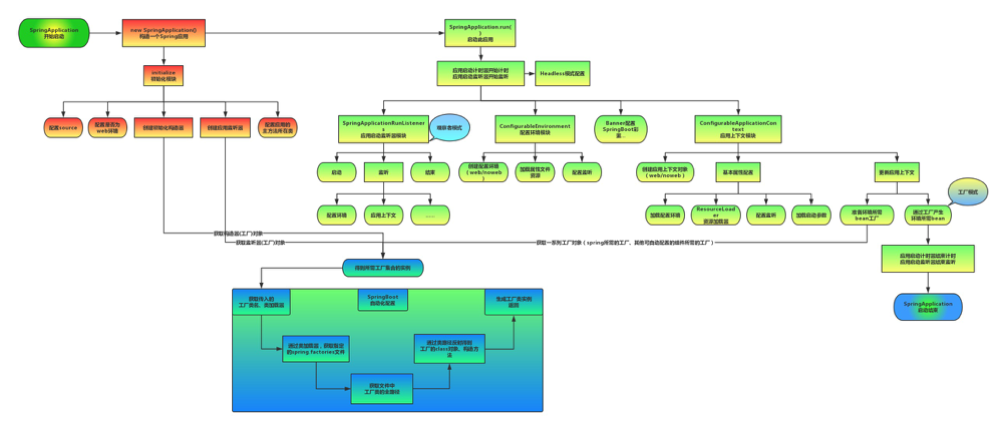
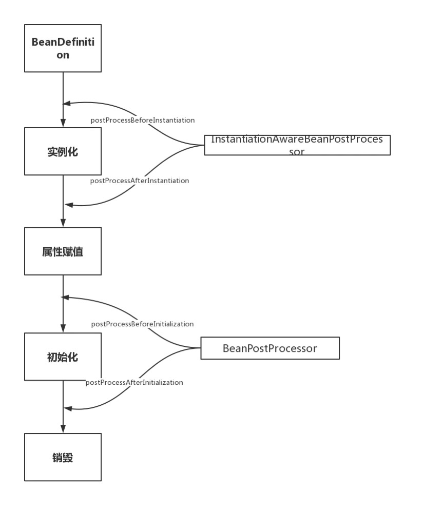

# Spring

## 简介

### Spring简介

Spring就是一个`创建对象的工厂`，实现了从new到反射的转变；

Spring也是一个`容器`，她用来创建、管理和维护对象的状态及各对象之间的依赖关系（IOC）；

Spring的两大核心`AOP/IOC`，在工厂使用了代理的设计模式；

AOP是面向切面编程，Java是面向对象编程。

1. Spring是一个开源框架
2. Spring为简化企业级开发而生，使用Spring开发可以`将Bean对象，Dao组件对象，Service组件对象等交给Spring容器来管理`，这样使得很多复杂的代码在Spring中开发却变得非常的优雅和简洁，有效的降低代码的耦合度，极大的方便项目的后期维护、升级和扩展。
3. Spring是一个IOC(DI)和AOP容器框架。
4. Spring的优良特性:
    1. 非侵入式：基于Spring开发的应用中的对象可以不依赖于Spring的API
    2. 控制反转：IOC——Inversion of Control，指的是`将对象的创建权交给Spring去创建`。使用Spring之前，对象的创建都是由我们自己在代码中new创建。而使用Spring之后。对象的创建都交给了Spring框架。
    3. 依赖注入：DI——Dependency Injection，是指依赖的对象不需要手动调用setXX方法去设置，而是通过配置赋值。
    4. 面向切面编程：Aspect Oriented Programming——AOP。
    5. 容器：Spring是一个容器，因为它包含并且管理应用对象的生命周期。
    6. 组件化：Spring实现了使用简单的组件配置组合成一个复杂的应用。在 Spring 中可以使用XML和Java注解组合这些对象。
    7. 一站式：在IOC和AOP的基础上可以整合各种企业应用的开源框架和优秀的第三方类库（实际上Spring 自身也提供了表述层的SpringMVC和持久层的Spring JDBC）



1. Spring Core：工厂，创建对象。维护对象之间的依赖关系（IOC）；
2. Spring AOP：面向切面编程，大量运用了代理设计模式；
3. Spring DAO：实现数据库操作的支持，可以支持JDBC；
4. Spring ORM(Object Relational Mapping, 对象关系映射)：对ORM类的框架进行支持，整合Hibernate、Mybatis；
5. Spring Context：Spring上下文模块，主要针对Spring配置文件；
6. Spring WEB：整合WEB框架，整合Struts、SpringMVC等；
7. Spring MVC：Spring针对MVC模式的实现。

### Sprig boot简介

Spring Boot(英文中是“引导”的意思)，是`用来简化Spring应用的搭建到开发的过程。应用开箱即用`，只要通过 “just run”(可能是 java -jar 或 tomcat 或 maven插件run 或 shell脚本)，就可以启动项目。`Spring Boot 只要很少的Spring配置文件(例如那些xml，property)`。

### ORM简介

用于实现面向对象编程语言里`不同类型系统的数据之间的转换`：

- ORM是`通过使用描述对象和数据库之间映射的元数据，将程序中的对象与关系数据库相互映射`。
- ORM可以`解决数据库与程序间的异构性`，比如：在Java中我们使用String表示字符串，而Oracle中可使用varchar2，MySQL中可使用varchar，SQLServer可使用nvarchar。
主要作用：
- 它是一种将`内存中的对象保存到关系型数据库中的技术`;
- 主要负责`实体域对象的持久化，封装数据库访问细节`;
- 提供了实现持久化层的另一种模式，`采用映射元数据（XML）来描述对象-关系的映射细节`，使得ORM中间件能在任何一个Java应用的业务逻辑层和数据库之间充当桥梁。

Java典型的ORM中有:

- hibernate：`全自动`的框架，强大、复杂、笨重、学习成本较高;
- Mybatis：`半自动`的框架(懂数据库的人 才能操作) `必须要自己写sql`;

### AOP

AOP(Aspect Oriented Programming 面向切面编程)。利用AOP可以`对业务逻辑的各个部分进行隔离，从而使得业务逻辑各部分之间的耦合度降低，提高程序的可重用性，同时提高了开发的效率`。

- 主要的功能是：日志记录，性能统计，安全控制，事务处理，异常处理等等，`解决代码复用`。
- 主要的意图是：将日志记录，性能统计，安全控制，事务处理，异常处理等代码从业务逻辑代码中划分出来，通过对这些行为的分离，我们希望可以将它们独立到非指导业务逻辑的方法中，进而`改变这些行为的时候不影响业务逻辑的代码`。

#### AOP底层实现原理

静态代理和动态代理:

- 静态代理：由程序员创建或工具生成代理类的源码，再编译代理类。所谓静态也就是在程序运行前就已经存在代理类的字节码文件，代理类和委托类的关系在运行前就确定了。
- 动态代理：
  - 代理对象,`不需要实现接口`
  - 代理对象的生成,是利用JDK的API,`动态的在内存中构建代理对象`(需要我们指定创建代理对象/目标对象实现的接口的类型)
  - 动态代理也叫做:JDK代理,接口代理

静态代理和动态代理的区别：

- 静态代理`需要`生成`目标代理对象`，不推荐。
- 动态代理`不需要`生成`目标代理对象`的。
  - 动态代理分为`JDK动态代理`、`CGLIB动态代理`。

Sprin中动态代理的选取方式（spring会自动在JDK动态代理和CGLIB之间转换）：
|实现接口|Spring 如何实现AOP|
|---|:---:|
|是|默认情况下会采用JDK的动态代理实现AOP|
|是|可以强制使用CGLIB实现AOP(EnableAspectJAutoProxy(proxyTargetClass = true))|
|否|必须采用CGLIB库|

代码示例

```java
@Aspect
public class TransactionDemo {
    @Pointcut(value="execution(* com.core.service.*.*.*(..))")
    public void point(){
    }
    @Before(value="point()")
    public void before(){
        System.out.println("transaction begin");
    }
    @AfterReturning(value = "point()")
    public void after(){
        System.out.println("transaction commit");
    }
    @Around("point()")
    public void around(ProceedingJoinPoint joinPoint) throws Throwable{
        System.out.println("transaction begin");
        joinPoint.proceed();
        System.out.println("transaction commit");
    }
}

```

#### jdk动态代理 和 CGLIB动态代理

||jdk动态代理|CGLIB动态代理|
|---|:---:|:---:|
|原理|是根据类加载器和接口创建代理类（此代理类是接口的实现类，所以必须使用接口 面向接口生成代理）|使用cglib(Code Generation Library)实现动态代理，并不要求委托类必须实现接口。底层采用asm字节码生成框架生成代理类的字节码，对代理对象类的class文件加载进来，通过修改其字节码生成子类来处理。 |
|区别|java动态代理是利用反射机制生成一个实现代理接口的匿名类，在调用具体方法前调用InvokeHandler来处理。|而cglib动态代理是利用asm开源包，对代理对象类的class文件加载进来，通过修改其字节码生成子类来处理。|
|缺点|jdk动态代理，必须是面向接口，目标业务类必须实现接口|因为是继承，所以该类或方法最好不要声明成final ，final可以阻止继承和多态。|

#### AOP编程使用

1. `@Aspect` 指定一个类为切面类
2. `@Pointcut`("execution(* com.itmayiedu.service.UserService.add(..))")  指定切入点表达式
3. `@Before`("pointCut_()") 前置通知: 目标方法之前执行
4. `@After`("pointCut_()") 后置通知：目标方法之后执行（始终执行）
5. `@AfterReturning`("pointCut_()")  返回后通知： 执行方法结束前执行(异常不执行)
6. `@AfterThrowing`("pointCut_()") 异常通知:  出现异常时候执行
7. `@Around`("pointCut_()") 环绕通知： 环绕目标方法执行

### IOC

### Spring 循环依赖

对于普通的循环依赖如A 依赖B， B依赖A。在初始化A的时候，会实例化B，实例化B发现需要A的引用，这时候通过缓存返回A的引用。虽然A还未初始化完毕，但是由于是对象的引用，所以最终初始化完成的时候，两个对象均是初始化完整的。

### Spring boot 自动配置的加载流程

1. Spring boot的配置自动加载主要通过@SpringBootApplication 中的 `@EnableAutoConfiguration注解实现`
2. 注解中@Import(AutoConfigurationImportSelector.class) 的类。借助@Import的支持，收集和注册特定场景相关的bean定义。
3. 该AutoConfigurationImportSelector类的getAutoConfigurationEntry方法会扫描所有包下spring-autoconfigure-metadata.properties的属性
4. 通过@ConditionOn的系列注解并对比过滤符合当前配置的配置项，重新进行config的注解扫描添加需要的bean配置到BenDefinition中
5. 再执行初始化方法。

### Spring mvc 工作原理

一个http请求发送过来先经过Servlet的filter进行过滤，之后进入MVC流程


1. 客户端（浏览器）发送请求，`直接请求到 DispatcherServlet`。
2. DispatcherServlet 根据请求信息调用 HandlerMapping，`解析请求对应的 Handler`。
3. `解析到对应的 Handler（也就是我们平常说的 Controller 控制器）`后，开始由 HandlerAdapter 适配器处理。
4. HandlerAdapter 会`根据 Handler 来调用真正的处理器来处理请求，并处理相应的业务逻辑`。调用handler的时候，如果有继承HandlerInterceptor接口，就对应拦截处理。
5. `处理器处理完业务后，会返回一个 ModelAndView 对象`，Model 是返回的数据对象，View 是个逻辑上的 View。
6. `ViewResolver 会根据逻辑 View 查找实际的 View`。
7. `DispatcherServlet 把返回的 Model 传给 View Resolver`（视图渲染）。
8. `把 View 返回给请求者`（浏览器）

### BeanFactory和ApplicationContext的区别

BeanFactory：负责`配置、创建、管理bean`，IOC功能的实现主要就依赖于该接口子类实现。

ApplicationContext 是 Spring 应用程序中的中央接口，用于向应用程序提供配置信息。`它继承了 BeanFactory 接口，所以 ApplicationContext 包含 BeanFactory 的所有功能以及更多功能`。

`BeanFactory是Spring框架的基础设施，面向Spring本身`；而`ApplicationContext面向使用Spring的开发者`，相比BeanFactory提供了更多面向实际应用的功能，几乎所有场合都可以直接使用ApplicationContext而不是底层的BeanFactory。

### spring boot启动过程



1. 新建SpringApplication对象;
2. 进行模块初始化：
   - `配置source`；
   - `配置是否为web环境`；
   - 创建`初始化构造器`==>用来通过构造器对象获取工厂集合实例；
   - 创建`应用监听器`==>用来通过监听器获取工厂对象。
3. 通过run方法启动此应用；
   - `应用启动监听器模块`；
     - 监听`配置环境`及`应用上下文`
   - `配置环境模块`；
     - `创建配置环境`（web/noweb）==>用于生成对象；
     - `加载属性文件资源`；
     - 配置监听；
   - `应用上下文模块`
     - `创建应用上下文对象`（web/noweb）
     - `基本属性配置`；
       - 加载配置环境；
       - 加载启动参数；
       - 配置监听；
     - `更新应用上下文`；
       - 准备环境所需bean工厂;
       - 通过工厂生产环境所需bean;

### @RestController vs @Controller

@RestController实现试过以下方式

```java
@Controller
@ResponseBody
public @interface RestController { ... }
```

@ResponseBody 注解的作用是`将 Controller 的方法返回的对象通过适当的转换器转换为指定的格式之后，写入到HTTP 响应(Response)对象的 body 中`，通常用来返回 JSON 或者 XML 数据，返回 JSON 数据的情况比较多。

### spring中的设计模式

- 工厂设计模式 : Spring使用工厂模式通过`BeanFactory、ApplicationContext`创建 bean 对象。
- 代理设计模式 : `Spring AOP 功能的实现`。
- 单例设计模式 : Spring 中的 Bean 默认都是单例的。
- 模板方法模式 : Spring 中 jdbcTemplate、hibernateTemplate 等以 Template 结尾的对数据库操作的类，它们就使用到了模板模式。
- 包装器设计模式 : 我们的项目需要连接多个数据库，而且不同的客户在每次访问中根据需要会去访问不同的数据库。这种模式让我们可以根据客户的需求能够动态切换不同的数据源。
- 观察者模式: Spring 事件驱动模型就是观察者模式很经典的一个应用。
- 适配器模式 :Spring AOP 的增强或通知(Advice)使用到了适配器模式、spring MVC 中也是用到了适配器模式适配Controller。

### @Autowired和@Resource的区别

- `@Autowired注解是按类型装配依赖对象`，默认情况下它要求依赖对象必须存在，如果允许null值，可以设置它required属性为false。可以结合@Qualifier注解一起使用。
  - 按照类型去IOC容器中找到对应的组件，userService=ioc.getBean(UserService.class)
    1. 找到一个找到就赋值
    2. 没找到，抛异常
    3. 找到多个
       - 再按照成员变量名（userService）作为id继续匹配？userService=ioc.getBean("userService",userService.class);
         1. 找到：装配
         2. 找不到：抛异常
  - 如果我们将@Autowired的required属性设置为false（@Autowired标注的自动装配的属性默认是一定装配上的）
      1. 找到就装配
      2. 找不到就装配null

- @Resource注解和@Autowired一样，也可以标注在字段或属性的setter方法上，但它默认按名称装配。默认按byName自动注入，也提供按照byType 注入；
- @Resources按名字，是JDK的，@Autowired按类型，是Spring的。
- 处理这2个注解的BeanPostProcessor不一样CommonAnnotationBeanPostProcessor是处理@Resource注解的，AutoWiredAnnotationBeanPostProcessor是处理@AutoWired注解的

```java
@Autowired() 
@Qualifier("baseDao")     
private BaseDao baseDao;    

@Resource(name="baseDao")     
private BaseDao baseDao;    
```

### Bean的生命周期

- 对于普通的Java对象，当new的时候创建对象，当它没有任何引用的时候被垃圾回收机制回收。
- 而由Spring IoC容器托管的对象，它们的生命周期完全由容器控制。Spring中每个Bean的生命周期如下：


1. 实例化 (Instantiation) -> createBeanInstance()
2. 属性赋值 (Populate) -> populateBean()
3. 初始化 (Initialization) -> initializeBean()
4. 销毁 Destruction -> DisposableBean()
