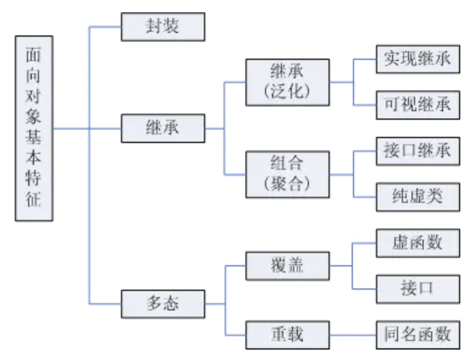
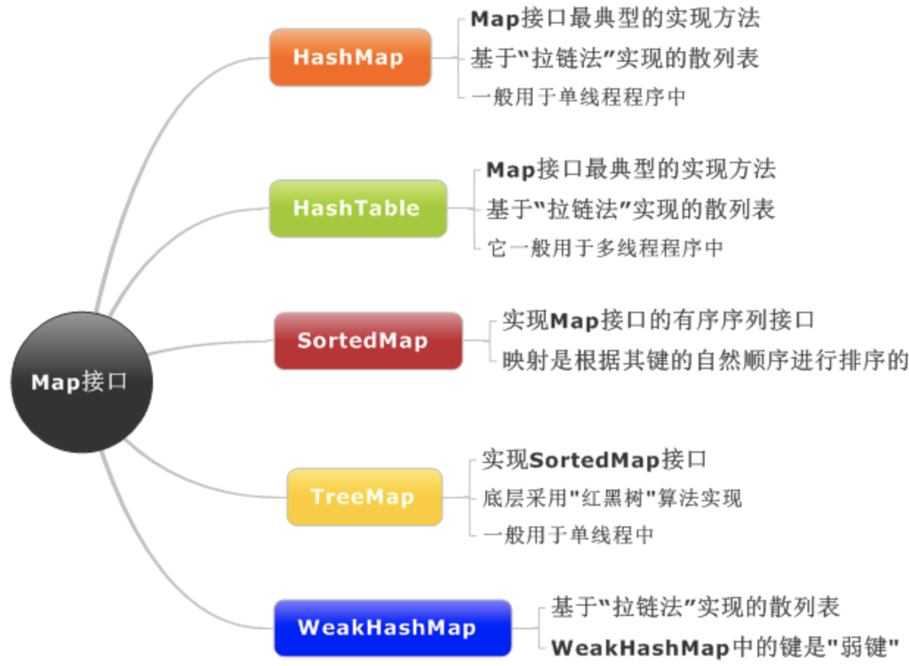

# java基础

## 面向对象

对象的含义是指具体的某一个事物，即在现实生活中能够看得见摸得着的事物。在面向对象程序设计中，对象所指的是计算机系统中的某一个成分。在面向对象程序设计中，`对象包含两个含义，其中一个是数据，另外一个是动作`。对象则是数据和动作的结合体。对象不仅能够进行操作，同时还能够及时记录下操作结果。

面向对象编程（Object Oriented Programming，OOP，面向对象程序设计）的主要思想是把构成问题的各个事务分解成各个对象，建立对象的目的不是为了完成一个步骤，而是为了描叙一个事物在整个解决问题的步骤中的行为。面向对象程序设计中的概念主要包括：对象、类、数据抽象、继承、动态绑定、数据封装、多态性、消息传递。通过这些概念面向对象的思想得到了具体的体现。

### 特征

1. 对象唯一性。
每个对象都有自身唯一的标识，通过这种标识，可找到相应的对象。在对象的整个生命期中，它的标识都不改变，不同的对象不能有相同的标识。
2. 抽象性
抽象性是指将具有一致的数据结构（属性）和行为（操作）的对象抽象成类。一个类就是这样一种抽象，它反映了与应用有关的重要性质，而忽略其他一些无关内容。任何类的划分都是主观的，但必须与具体的应用有关。
3. 继承性
继承性是子类自动共享父类数据结构和方法的机制，这是类之间的一种关系。在定义和实现一个类的时候，可以在一个已经存在的类的基础之上来进行，把这个已经存在的类所定义的内容作为自己的内容，并加入若干新的内容。
4. 多态性（多形性）
多态性是指相同的操作或函数、过程可作用于多种类型的对象上并获得不同的结果。不同的对象，收到同一消息可以产生不同的结果，这种现象称为多态性。多态性允许每个对象以适合自身的方式去响应共同的消息。多态性增强了软件的灵活性和重用性。

### 面向过程

面向过程就是分析出解决问题所需要的步骤，然后用函数把这些步骤一步一步实现，使用的时候一个一个依次调用就可以了；面向对象是把构成问题事务分解成各个对象，建立对象的目的不是为了完成一个步骤，而是为了描叙某个事物在整个解决问题的步骤中的行为。

## 八大基本数据类型

| 类型 | 长度 | 取值范围 | 占用字节数 |
| --- |:---: | :-----: | ----- |
|boolean|1|0/1|
|byte|8:|-128~127|1个字节|
|char|16|ASCII码|2个字节|
|short|16|-32768~32767|2个字节|
|int|32|$-2^{31}$~$2^{31}-1$|4个字节|
|float|32|$-3.40292347 \cdot 10^{38}$~$3.40292347 \cdot 10^{38}$|4个字节|
|long|64|$-2^{63}$~$2^{63}-1$|8个字节|
|double|64|8个字节，IEEE754|8个字节|

基本数据类型转换关系: byte→short(char)→int→long→float→double

## 包装类型

### 概念

所谓包装类，就是能够直接将`简单类型`的变量表示为一个`类`，在执行变量类型的相互转换时，我们会大量使用这些包装类。

### 用途

1. 作为基本数据类型对应的类类型，提供了一系列实用的`对象操作`，如类型转换，进制转换等
2. `集合不允许存放基本数据类型`，故常用包装类
3. 包含了每种基本类型的`相关属性`，如最大值，最小值，所占位数等

### new Integer(123) 与 Integer.valueOf(123) 的区别在于

- new Integer(123) 每次都会新建一个对象；
- Integer.valueOf(123) 会使用缓存池中的对象，多次调用会取得同一个对象的引用。

### 缓冲池

包装类型内存使用 private static class IntegerCache，声明一个内部使用的缓存池

#### 基本类型对应的缓冲池

范围在`一个字节=8bit`内的值会被缓冲到缓冲池中：
|类型|缓冲池范围|
|-|-|
|boolean|true and false|
|byte values|all byte values|
|short values|-128 and 127|
|int|-128 and 127|
|char|\u0000 to \u007F|
  
### String

String 被声明为 final，因此它不可被继承。private final char value[]，private的私有访问权限的作用都比final大。。Java 8 中，String 内部使用 char 数组存储数据。  

#### final不可变的好处

- 可以缓存 hash 值:因为字符串是不可变的，所以在它创建的时候hashcode就被缓存了，不需要重新计算
- String Pool 的需要。如果一个 String 对象已经被创建过了，那么就会从 String Pool 中取得引用。只有 String 是不可变的，才可能使用 String Pool。
- 安全性。String 经常作为参数，String 不可变性可以保证参数不可变。譬如，数据库的用户名、密码都是以字符串的形式传入来获得数据库的连接。
- 线程安全[new String("abc") :创建两String对象，（前提是 String Pool 中还没有 "abc" 字符串对象）。]:因为字符串是不可变的，所以是多线程安全的，同一个字符串实例可以被多个线程共享。

```java
 String a = "hello2"; 　  
 String b = "hello";       
 String c = b + 2;       
 System.out.println((a == c));
 # 输出结果为:false。由于有符号引用的存在，所以  String c = b + 2;不会在编译期间被优化，不会把b+2当做字面常量来处理的

 String a = "hello2";   　
 final String b = "hello";       
 String c = b + 2;       
 System.out.println((a == c));
 # 输出结果为：true。对于被final修饰的变量，会在class文件常量池中保存一个副本，也就是说不会通过连接而进行访问
```

### String, StringBuffer and StringBuilder

1. 操作少量的数据: 适用String
2. 单线程操作字符串缓冲区下操作大量数据: 适用StringBuilder
3. 多线程操作字符串缓冲区下操作大量数据: 适用StringBuffer

### AbstractStringBuilder 扩容

扩容的大小是`新字符串的长度的2倍，然后再加上2`：在使用StringBuilder的时候，append()之后，我们一般会在后面在加上一个分隔符，例如逗号，也就是再加上一个char，而`char在java中占2个字节`，避免了因为添加分隔符而再次引起扩容。

## 关键字

### final

- 数据：声明数据为常量，可以是编译时常量，也可以是在运行时被初始化后不能被改变的常量；
- 对于基本类型，final 使数值不变；
- 对于引用类型，final 使引用不变，也就不能引用其它对象，但是`被引用的对象本身是可以修改的`；
- 方法：声明方法不能被子类重写（private 方法隐式地被指定为 final，如果在子类中定义的方法和基类中的一个 private 方法签名相同，此时子类的方法不是重写基类方法，而是在子类中定义了一个新的方法。）；
- 类：声明类不允许被继承。

### static

1. 静态变量：又称为类变量，也就是说这个变量属于类的，类所有的实例都共享静态变量，可以直接通过类名来访问它。`静态变量在内存中只存在一份`。说其静态，是因为它不会随着函数的调用和退出而发生变化。即上次调用函数的时候，如果我们给静态变量赋予某个值的话，下次函数调用时，这个值保持不变。被static修饰的变量属于类变量，可以通过类名.变量名直接引用，而不需要new出一个类来.
   - 针对于静态变量储存在方法区中，而静态对象方法区存储引用，对象放在堆中。
2. 静态方法：静态方法在类加载的时候就存在了，它不依赖于任何实例。所以静态方法必须有实现，也就是说它不能是抽象方法。(只能访问所属类的静态字段和静态方法，方法中不能有 this 和 super 关键字，这两个关键字与具体对象关联).被static修饰的方法属于类方法，可以通过类名.方法名直接引用，而不需要new出一个类来。
3. 静态语句块：静态语句块在类初始化时运行一次。
4. 静态内部类：非静态内部类依赖于外部类的实例，也就是说需要先创建外部类实例，才能用这个实例去创建非静态内部类。而静态内部类不需要。
5. 静态导包：在使用静态变量和方法时不用再指明 ClassName。增强可读性。

```java
import static com.xxx.ClassName.*
```

- 初始化顺序 ：静态变量和静态语句块优先于实例变量和普通语句块，静态变量和静态语句块的初始化顺序取决于它们在代码中顺

    ```java
    // 1
    public static String staticField = "静态变量";
    // 2
    static {
        System.out.println("静态语句块");
    }
    // 3
    public String field = "实例变量";
    // 4
    {
        System.out.println("普通语句块");
    }

    最后才是构造函数的初始化。
    // 5
    public InitialOrderTest() {
        System.out.println("构造函数");
    }
    ```

- 存在继承的情况下，初始化顺序为：（静态>普通、父类>子、变量和语句块看顺序）
  - 父类（静态变量、静态语句块）
  - 子类（静态变量、静态语句块）
  - 父类（实例变量、普通语句块）
  - 父类（构造函数）
  - 子类（实例变量、普通语句块）
  - 子类（构造函数）

### volatile

volatile 的作用主要有两个,一个是防止指令重排序/一个是保持内存的可见性.

1. 指令重排序  
JVM 编译器会对指令进行重排序以提升并发性能.会让指令按照非程序语义的顺序执行.有编译重排序,处理器指令重排序、内存重排序。而指令重排序在多线程情况下可能存在问题,比如单例模式,多线程下可能获取未初始化的对象。

    创建对象的过程：
   1. 申请内存地址.
   2. 在内存地址上初始化对象
   3. 将引用指向内存地址  

    假设按照 1->3->2 的顺序执行.就会存在问题。我们通过增加 volatile 关键字来禁用重排序。
2. 内存可见  
`可见性就是一个线程修改了某个变量的值,其他线程就能立即看到修改的值`。Jvm 内存模型规定了所有的变量都是存储在主存中的,每个线程还有自己的工作线程,工作线程保存了主存变量的副本,不同线程间通讯需要先同步到主存。使用 volatile 修饰能在每次变量发生变化后,`强制刷新到主存`。
3. 内存屏障
阻止屏障两侧的指令重排序;即屏障下面的代码不能跟屏障上面的代码交换执行顺序强制把写缓冲区/高速缓存中的脏数据等写回主内存，让缓存中相应的数据失效。  
对于 Load Barrier 来说，在指令前插入 Load Barrier，可以让 CPU 高速缓存中 j 的数据失效，强制从新从主 内存加载新数据;对于 Store Barrier 来说，在指令后插入 Store Barrier，能让写入缓存中的最新数据更新写入主内存，让其 他线程可见。

## Object 通用方法

### equals()

1. 等价与相等
   - 对于`基本类型`，== 判断两个值是否相等，基本类型没有 equals() 方法。
   - 对于`引用类型`，== 判断两个变量是否引用同一个对象，而 equals() 判断`引用的对象`是否等价。
2. 如何重写：
   1. 检查是否为同一个对象的引用，如果是直接返回 true；
   2. 检查是否是同一个类型，如果不是，直接返回 false；
   3. 将 Object 对象进行转型；
   4. 判断每个关键域是否相等。

   ```java
   @Override
   public boolean equals(Object o) {
       // 检查是否为同一个对象的引用
       if (this == o) return true;
       // 检查是否是同一个类型
       if (o == null || getClass() != o.getClass()) return false;
       // 将 Object 对象进行转型
       EqualExample that = (EqualExample) o;
       // 判断每个关键域是否相等。
       if (x != that.x) return false;
       if (y != that.y) return false;
       return z == that.z;
    }
    ```

### hashCode()

1. hashCode()：hashCode是jdk根据对象的地址或者字符串或者数字算出来的int类型的数值.
   - 对象按照自己不同的特征尽量的有不同的哈希码，作用是用于快速查找
   - 另一个应用就是hash集合的使用
2. 重写hashcode方法:

    ```java
    private String name;
    private int age;
    
    @Override
    public int hashCode() {
        int result = 17;
        result = result * 31 + name.hashCode();
        result = result * 31 + age;
        
        return result;
    }
    ```

### toString()

默认返回 对象名@4554617c 这种形式，其中 @ 后面的数值为散列码的无符号十六进制表示。

### clone()

主要用于对象的拷贝克隆，如果一个对象不实现clone接口方法，默认抛出`CloneNotSupportedException`。  
对象的拷贝分为浅拷贝与深拷贝：

- 浅拷贝是按位拷贝对象，它会创建一个新对象，这个对象有着原始对象属性值的一份精确拷贝。如果属性是基本类型，拷贝的就是基本类型的值；如果属性是`内存地址（引用类型），拷贝的就是内存地址` ，因此如果其中一个对象改变了这个地址，就会影响到另一个对象。
- 深拷贝则是在拷贝引用类型成员变量时，为引用类型的数据成员另辟了一个独立的内存空间，实现真正内容上的拷贝。

## 继承

继承就是子类继承父类的特征和行为，使得子类对象（实例）具有父类的实例域和方法，或子类从父类继承方法，使得子类具有父类相同的行为。在 Java 中通过 extends 关键字可以申明一个类是从另外一个类继承而来的，一般形式如下：

```java
class 父类 {
}
 
class 子类 extends 父类 {
}
```


Java 的三个访问权限修饰符：private、protected 和 public。

- 如果`不加访问修饰符`，表示`包级可见`。
- protected 用于修饰成员，表示在继承体系中成员对于子类可见，但是这个访问修饰符对于类没有意义。
- private 仅自己可见
- public 所有均可见

private 和 protected 不能修饰类。

1. 设计良好的模块会隐藏所有的实现细节，把它的 API 与它的实现清晰地隔离开来。模块之间只通过它们的 API 进行通信。
2. 如果子类的方法重写了父类的方法，那么子类中该方法的访问级别不允许低于父类的访问级别。这是为了确保可以使用父类实例的地方都可以使用子类实例去代替，也就是确保满足里氏替换原则。

特性：

- 子类拥有父类非 private 的属性、方法。
- 子类可以拥有自己的属性和方法，即子类可以对父类进行扩展。
- 子类可以用自己的方式实现父类的方法。
- Java 的继承是单继承，但是可以多重继承，单继承就是一个子类只能继承一个父类，多重继承就是，例如 B 类继承 A 类，C 类继承 B 类，所以按照关系就是 B 类是 C 类的父类，A 类是 B 类的父类，这是 Java 继承区别于 C++ 继承的一个特性。
- 提高了类之间的耦合性（继承的缺点，耦合度高就会造成代码之间的联系越紧密，代码独立性越差）。

## 抽象类与接口

### 抽象类(abstract class)

抽象类和普通类最大的区别是，`抽象类不能被实例化，只能被继承`。

- 如果一个类中包含抽象方法，那么这个类必须声明为抽象类。
- 抽象类和抽象方法都使用 abstract 关键字进行声明。

### 接口(interface)

接口是抽象类的延伸，在 Java 8 之前，它可以看成是一个完全抽象的类，也就是说它不能有任何的方法实现。

- 以前，接口里的方法要求全部是抽象方法，从 Java 8 开始，接口也可以拥有默认的方法实现

    ```java
    public interface MyInter {
        default void df() {    //声明一个接口的默认方法
            System.out.println("i'am default f");
            sf();        //调用本接口的类方法
        }
    
        static void sf() {    //声明一个接口的类方法
            System.out.println("i'am static f");
        }
    }
    ```

- 接口的成员（字段 + 方法）默认都是 public 的，并且`不允许定义为 private 或者 protected`。
- 接口的字段默认都是 static 和 final 的。

### 比较

设计层面:  

- 抽象类的实现目的，是代码复用，一种模板设计的方式，可以让这些类都派生于一个抽象类。
- 接口的设计目的，是对类的行为进行约束（更准确的说是一种“有”约束，因为接口不能规定类不可以有什么行为），也就是提供一种机制，可以强制要求不同的类具有相同的行为。
  
使用上来看，一个类可以实现多个接口，但是不能继承多个抽象类。

- 接口的字段只能是 static 和 final 类型的，而抽象类的字段没有这种限制。
- 接口的成员只能是 public 的，而抽象类的成员可以有多种访问权限。

设计上对比：

- 抽象类： 拓展继承该抽象类的模块的类的行为功能（开放闭合原则）
- 接口：约束继承该接口的类行为（依赖倒置原则）

## 重写与重载

### 重写（Override）

重写：存在于继承体系中，指`子类实现了一个与父类在方法声明上完全相同的一个方法`。

重写有以下三个限制(子类>=父类)：

- 子类方法的访问权限必须大于等于父类方法；
- 子类方法的返回类型必须是父类方法返回类型或为其子类型；
- 子类方法抛出的异常类型必须是父类抛出异常类型或为其子类型。

使用 @Override 注解，可以`让编译器帮忙检查是否满足上面的三个限制条件`。

### 重载（Overload）

重载：存在于同一个类中，指一个方法与已经存在的`方法名称上相同`，但是`参数类型、个数、顺序至少有一个不同`。应该注意的是，`返回值不同，其它都相同不算是重载`。

### 两者比较

|区别点 |重载方法 |重写方法|
|--|--|:--:|
|参数列表|必须修改|一定不能修改|
|返回类型|可以修改|一定不能修改|
|异常|可以修改|可以减少或删除，一定不能抛出新的或者更广的异常|
|访问|可以修改|一定不能做更严格的限制（可以降低限制）|

方法的重写(Overriding)和重载(Overloading)是java多态性的不同表现，重写是父类与子类之间多态性的一种表现，重载可以理解成多态的具体表现形式。

1. 方法重载是一个类中定义了多个方法名相同,而他们的参数的数量不同或数量相同而类型和次序不同,则称为方法的重载(Overloading)。
2. 方法重写是在子类存在方法与父类的方法的名字相同,而且参数的个数与类型一样,返回值也一样的方法,就称为重写(Overriding)。
3. 方法重载是一个类的多态性表现,而方法重写是子类与父类的一种多态性表现。

## 反射

反射可以提供运行时的类信息，并且这个类可以在运行时才加载进来，甚至在编译时期该类的 `.class` 不存在也可以加载进来。

在 Java 中的反射机制是指在运行状态中，对于任意一个类都能够知道这个类所有的属性和方法;并且对于任意一个对象，都能够调用它的任意一个方法;这种动态获取信息以及动态调用对象方法的功能成为 Java 语言的反射机制。

1. 当编译一个新类时，会产生一个同名的 .class 文件，该文件内容保存着 Class 对象。
2. 类加载相当于 Class 对象的加载，`类在第一次使用时才动态加载到 JVM 中`。
3. 也可以使用 Class.forName("com.mysql.jdbc.Driver") 这种方式来控制类的加载，该方法会返回一个 Class 对象

Class 和 java.lang.reflect 一起对反射提供了支持，java.lang.reflect 类库主要包含了以下三个类：

- Field ：可以使用 get() 和 set() 方法读取和修改 Field 对象关联的字段；
- Method ：可以使用 invoke() 方法调用与 Method 对象关联的方法；
- Constructor ：可以用 Constructor 的 newInstance() 创建新的对象。

反射的优点：

- 可扩展性 ：应用程序可以利用全限定名创建可扩展对象的实例，如com.demo.Test。
- 调试器和测试工具： 调试器需要能够检查一个类里的私有成员。测试工具可以利用反射来自动地调用类里定义的可被发现的 API 定义，以确保一组测试中有较高的代码覆盖率。
- 开发工具：如IDEA开发工具可以从反射中获取类的信息，帮助开发人员代码编写。

反射的缺点：如果一个功能可以不用反射完成，那么最好就不用。

- 性能开销：反射涉及了动态类型的解析，所以 JVM 无法对这些代码进行优化。因此，反射操作的效率要比那些非反射操作低得多。
- 安全限制：使用反射技术要求程序必须在一个没有安全限制的环境中运行。
- 内部暴露：反射破坏了封装性，可能会导致意料之外的副作用，这可能导致代码功能失调并破坏可移植性

```java
//获取 Person 类的 Class 对象
Class clazz=Class.forName("reflection.Person");
//使用.newInstane 方法创建对象
Person p=(Person) clazz.newInstance();
//获取构造方法并创建对象
Constructor c=clazz.getDeclaredConstructor(String.class,String.class,int.class);
//创建对象并设置属性
Person p1=(Person) c.newInstance("李四","男",20);
```

## 异常

Throwable 可以用来表示任何可以作为异常抛出的类，分为两种： Error 和 Exception。其中 Error 用来表示 JVM 无法处理的错误，

Exception 分为两种：

- 受检异常 ：需要用 try...catch... 语句捕获并进行处理，并且可以从异常中恢复；
- 非受检异常 ：是程序运行时错误，例如除 0 会引发 Arithmetic Exception，此时程序崩溃并且无法恢复
- 运行时异常（runtime exception）:NullPointException、ClassCastException、IllegalArgumentException、IndexOutOfBoundException

try语句return问题：如果try语句里有return，返回的是try语句块中变量值（如果有返回值，就把返回值保存到局部变量中；执行jsr指令跳到finally语句里执行；执行完finally语句后，返回之前保存在局部变量表里的值。针对对象引用的返回，如果finally中有修改值，返回的是引用的对象。==>局部变量不变，引用变量修改）。如果try，finally语句里均有return，忽略try的return，而使用finally的return。

## 泛型

泛型的本质是参数化类型，也就是`所操作的数据类型被指定为一个参数`。

### 类型擦除

Java不能实现真正的泛型，只能使用类型擦除来实现伪泛型。

类型擦除后保留的原始类型：在调用泛型方法时，可以指定泛型，也可以不指定泛型。

- 在不指定泛型的情况下，泛型变量的类型为该方法中的几种类型的同一父类的最小级，直到Object；
- 在指定泛型的情况下，该方法的几种类型必须是该泛型的实例的类型或者其子类。

```java
Number f = Test.add(1, 1.2); //这两个参数一个是Integer，另一个是Float，所以取同一父类的最小级，为Number  
Object o = Test.add(1, "asd"); //这两个参数一个是Integer，另一个是String，所以取同一父类的最小级，为Object  

//这是一个简单的泛型方法  
public static <T> T add(T x,T y){  
  return y;  
}    
```

## 注解

### 内置注解

Java 定义了一套注解，共有7个，3个在`java.lang`中，剩下4个在`java.lang.annotation` 中。

1. 作用在代码的注解是:
   - @Override - 检查该方法是否是重写方法。如果发现其父类，或者是引用的接口中并没有该方法时，会报编译错误。
   - @Deprecated - 标记过时方法。如果使用该方法，会报编译警告。
   - @SuppressWarnings - 指示编译器去忽略注解中声明的警告。
2. 作用在其他注解的注解(或者说元注解)是:
   - @Retention - 标识这个注解怎么保存，是只在代码中，还是编入class文件中，或者是在运行时可以通过反射访问。
   - @Documented - 标记这些注解是否包含在用户文档中。
   - @Target - 标记这个注解应该是哪种 Java 成员。
   - @Inherited - 标记这个注解是继承于哪个注解类(默认注解并没有继承于任何子类)

从 Java 7 开始，额外添加了 3 个注解:

- @SafeVarargs - Java 7 开始支持，忽略任何使用参数为泛型变量的方法或构造函数调用产生的警告。
- @FunctionalInterface - Java 8 开始支持，标识一个匿名函数或函数式接口。
- @Repeatable - Java 8 开始支持，标识某注解可以在同一个声明上使用多次。

### 元注解

## 枚举类

枚举类比较使用==，同样也可以使用equals方法，Enum类中重写了equals实际上还是调用==方法。原因是因为：枚举类在jvm编译成class文件后，实际编译成使用final 修饰的class，final修饰就意味着实例化后不可修改，且都指向堆中的同一个对象。

## 方法调用

- 按值调用(call by value)表示方法接收的是调用者提供的值；
- 而按引用调用（call by reference)表示方法接收的是调用者提供的变量地址；
- 方法体传递参数时，无论是值还是对象都是“值”传递。引用类型传递的是引用变量的地址。

## 三大特性

- 封装:

    封装是指`把一个对象的状态信息（也就是属性）隐藏在对象内部`，不允许外部对象直接访问对象的内部信息。（setter()，getter()）  
  好处：
  1. 良好的封装能够减少耦合。
  2. 类内部的结构可以自由修改。
  3. 可以对成员进行更精确的控制。
  4. 隐藏信息，实现细节。
- 继承:

    不同类型的对象，相互之间经常有一定数量的共同点。继承是面向对象最显著的一个特性。`继承是从已有的类中派生出新的类，新的类能吸收已有类的数据属性和行为，并能扩展新的能力`。关键字（extends）让类与类之间产生继承关系。
- 多态:

    表示一个对象具有多种的状态，`对象在不同时刻表现出来的不同状态`。具体表现为父类的引用指向子类的实例。  
    方法的重写Overriding和重载Overloading是Java多态性的不同表现。重写Overriding是父类与子类之间多态性的一种表现，重载Overloading是一个类中多态性的一种表现。



## 序列化与反序列化

## 获取键盘输入的两种方式

```java
//通过 Scanner
Scanner input = new Scanner(System.in);
String s  = input.nextLine();
input.close();

// 通过 BufferedReader
BufferedReader input = new BufferedReader(new InputStreamReader(System.in));
String s = input.readLine();
```

## Arrays.asList()

Arrays.asList(): 返回的并不是 java.util.ArrayList ，而是 java.util.Arrays 的一个内部类,这个内部类并没有实现集合的add()、remove()、clear()会抛出异常unSupportedOperationException。

## java复制

对于基本类型，直接赋值复制，对于对象类型分为浅拷贝与深拷贝

- 浅拷贝：对引用数据类型进行引用传递般的拷贝，此为浅拷贝。
- 深拷贝：对基本数据类型进行值传递，对引用数据类型，创建一个新的对象，并复制其内容，此为深拷贝。

深拷贝的另一种方式，使用序列化和反序列化，获取一个新对象。

### Throw 和 throws 的区别

1. 位置不同:
    - throws 用在函数上，后面跟的是异常类，可以跟多个;而 throw 用在函数内，后面跟的是异常对象。

2. 功能不同:
    - throws 用来声明异常，让调用者只知道该功能可能出现的问题，可以给出预先的处理方式;throw 抛出具体的问题对象，执行到 throw，功能就已经结束了，跳转到调用者，并将具体的问题对象抛给调用者。也就是说 throw 语句独立存在时，下面不要定义其他语句，因为执行不到。
    - throws 表示出现异常的一种可能性，并不一定会发生这些异常;throw 则是抛出了异常，执行 throw 则一定抛出了某种异常对象.
    - 两者都是消极处理异常的方式，只是抛出或者可能抛出异常，但是不会由函数去处理异常，真正的处理异常由函数的上层调用处理。

## Q

### Wait 和 sleep 的区别

sleep 是让出 CPU 的时间片,但是并不释放他所持有的对象锁.
wait 是放弃对象锁,进入 ObjetMonitor 的 waitSet 中,notify 后重现尝试去竞争锁

### Java多线程三大特性

- 原子性：一个或者多个操作一旦开始之后其过程要么全部成功，要么全部失败，中间不会被打断，所以也不存在中间状态。
- 有序性：即程序执行的顺序按照代码的先后顺序执行。可是在jvm中很多时候程序并不是按照代码李所写的顺序执行的。  
    提供了volatile和synchronized两个关键字来保证线程之间操作的有序性，volatile关键字本身就包含了禁止指令重排序的语义，而synchronized则是由“一个变量在同一时刻只允许一条线程对其进行lock操作”这条规则来获得的，这个规则决定了持有同一个锁的两个同步块只能串行地进入。

- 可见性：可见性是指当一个线程修改了线程共享变量的值，其它线程能够立即得知这个修改。  
    除了volatile之外，Java还有两个关键字能实现可见性，它们是synchronized和final。同步块的可见性是由“对一个变量执行unlock操作之前，必须先把此变量同步回主内存中(执行store和write操作)”这条规则获得的，而final关键字的可见性是指：被final修饰的字段是构造器一旦初始化完成，并且构造器没有把“this”引用传递出去，那么在其它线程中就能看见final字段的值。

### LinkedList 和 ArrayList 的区别

- 数据结构:linkedlist 是基于双向链表,arraylist 是基于数组.
- 读写性能:尾部追加无性能差异,如果中间位置插入,linkedlist 要快,arraylist 随机查找性能更快
- 扩容机制:arraylist 空间不足时,需要进行扩容.
- 空间占用:linked 空间占用要稍微大一些.
  
### Map


