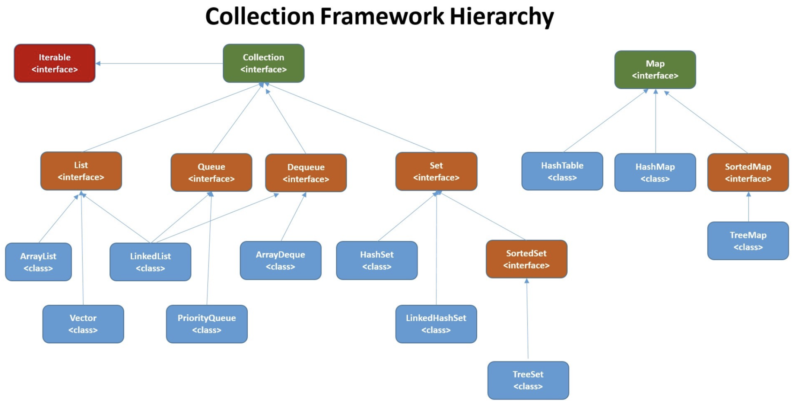

## java集合架构

集合主要分为两大类，一个实现collection接口的，一个是实现了Map接口的。
### list
| 类型 | 描述 | 说明 |
|---|:---:|---|
|ArrayList|Object[]数组|添加元素时使用 ensureCapacityInternal() 方法来保证容量足够，如果不够时，需要使用 grow() 方法进行扩容，新容量的大小为 oldCapacity + (oldCapacity >> 1)，也就是旧容量的 1.5 倍。|
|Vector|Object[]数组||
|CopyOnWriteArrayList|使用了读写分离的思想，在写数据的时候上ReentrantLock锁并新建一个数组，读数据仍从旧数组中读取，而新数据在新增或删除完成之后直接替换旧数组。虽然线程安全，对于频繁写数据的场景效率很低。|写操作在一个复制的数组上进行，读操作还是在原始数组中进行，读写分离，互不影响。|
|ListIterator|更强大的Iterator的子类，用于各种List类的访问，并支持双向移动。||
|LinkedList|LinkedList定义了一个内部的Node 节点，基于双向链表实现，使用 Node 存储链表节点信息。|getFirst() 和element() 完全一样，都返回第一个元素。如果为空，抛NoSuchElementException；peek() 方法与上诉类似，只时列表为空返回null；removeFirst() 和 remove() 类似，移除并返回列表的头，只是列表为空抛出NoSuchElementException；poll() 同样移除并返回列表头，只是列表为空返回Null|
|Stack||pop()、push()、 peek()方法，其中peek()返回栈顶元素，而不将其移除。|

### Map

| 类型 | 描述 | 说明 |
|--|--|--|
|HashMap|JDK1.8 之前 HashMap 由数组+链表组成的，JDK1.8 以后在解决哈希冲突时有了较大的变化，当链表长度大于阈值（默认为 8）（将链表转换成红黑树前会判断，如果当前数组的长度小于 64，那么会选择先进行数组扩容，而不是转换为红黑树）时，将链表转化为红黑树，以减少搜索时间|数组是 HashMap 的主体，链表则是主要为了解决哈希冲突而存在的（“拉链法”解决冲突）|
|LinkedHashMap|LinkedHashMap 继承自 HashMap|底层仍然是基于拉链式散列结构即由数组和链表或红黑树组成。另外，LinkedHashMap 在上面结构的基础上，增加了一条双向链表，使得上面的结构`可以保持键值对的插入顺序`。同时通过对链表进行相应的操作|
|Hashtable|数组+链表组成的。|HashMap线程不安全,HashTable线程安全|
|ConcurrentHashMap|线程安全的Map|--|
|TreeMap|基于红黑树的实现（自平衡的排序二叉树）。|“键”或“键值对”的次序是由Comparable或Comparator决定的。TreeMap是唯一带有subMap()方法的Map，可以返回一个子树。|
|WeakHashMap|弱键映射，允许设释放射所指对象。被垃圾收集器回收。|--|
|ConcurrentHashMap|线程安全的Map.|--|
|IdentityHashMap|使用==代替equals()对“键”进行比较的散列映射。|--|
|sortedMap|排序的Map，现阶段TreeMap是其唯一实现。|--|
|EnumMap|要求键必须来自一个Enum。|--|

### Set
- HashSet（无序，唯一）: 基于 HashMap 实现的，底层采用 HashMap 来保存元素。HashSet中的元素都存放在HashMap的key上面，而value中的值都是统一的一个固定对象`private static final Object PRESENT = new Object()`;
- LinkedHashSet：LinkedHashSet 是 HashSet 的子类，并且其内部是通过 LinkedHashMap 来实现的。有点类似于我们之前说的 LinkedHashMap 其内部是基于 HashMap 实现一样，不过还是有一点点区别的。
- TreeSet（有序，唯一）： 基于TreeMap实现，红黑树(自平衡的排序二叉树)

### 如何选用集合?
1. 主要根据集合的特点来选用，比如我们需要根据`键值获取到元素值`时就选用 `Map` 接口下的集合，`需要排序时选择 TreeMap`,`不需要排序时就选择 HashMap`,`需要保证线程安全就选用 ConcurrentHashMap`。
2. 当我们`只需要存放元素值`时，就选择实现`Collection接口的集合`，需要`保证元素唯一`时选择实现`Set接口`的集合比如 TreeSet 或 HashSet，不需要就选择实现 List 接口的比如 ArrayList 或 LinkedList，然后再根据实现这些接口的集合的特点来选用。