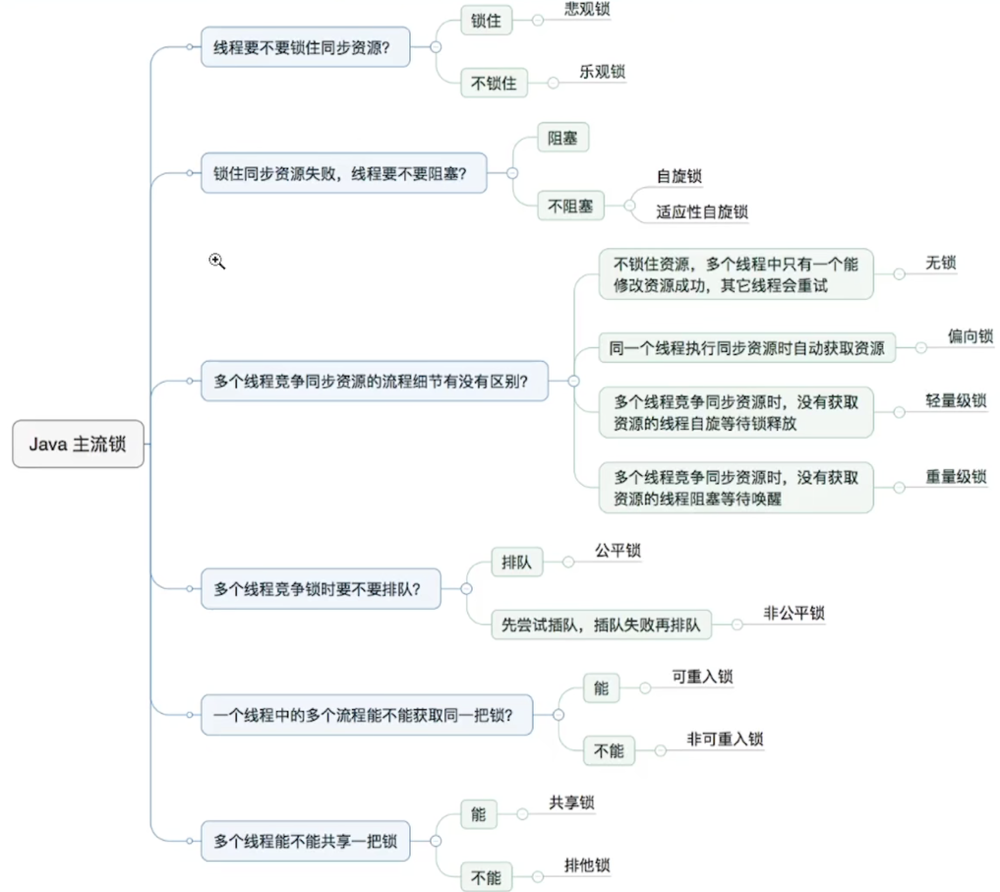

# Java主流锁

## 乐观锁和悲观锁

### 乐观锁

`乐观锁认为自己在使用数据时不会有别的线程修改数据`，所以不会添加锁，只是在更新数据的时候去判断之前有没有别的线程更新了这个数据。如果这个数据没有被更新，当前线程将自己修改的数据成功写入。如果数据已经被其他线程更新，则根据不同的实现方式执行不同的操作（例如报错或者自动重试）。Java通过CAS自旋实现。

### 悲观锁

对于同一个数据的并发操作，悲观锁认为自己在使用数据的时候一定有别的线程来修改数据，因此在获取数据的时候会先加锁，确保数据不会被别的线程修改。`Synchronized关键字和Lock都是悲观锁`。

## 共享锁互斥锁

### 共享锁（只做读取操作）

指该锁可同时被多个线程持有。常用于读取资源，ReentrantReadWriteLock的ReadLock就是共享锁。

### 互斥锁

互斥锁也叫做独享锁，是指该锁一次只能被一个线程所持有。Synchronized关键字和Lock的实现类就是互斥锁。

## 可重入锁和非可重入锁

### 可重入锁

指在同一个线程在外层方法获取锁的时候，再进入该线程的内层方法会自动获取锁（前提锁对象得是同一个对象或者class），不会因为之前已经获取过还没释放而阻塞。ReentrantLock和Synchronized都是可重入锁。可以有效避免死锁问题。

### 非可重入锁

是指在同一个线程在外层方法获取锁的时候，再进入该线程的内层方法无法再索取锁。会产生死锁问题。

## 自旋锁和非自旋锁

### 自旋锁（例如在堵车时，大多司机不会立马关闭发动机）

在尝试获取锁失败后，并不会立刻放弃CPU的执行时间，而是不断的尝试获取锁。但并不是无脑的进行尝试，如果尝试了一段时间后，还无法获取到锁，此时便会放弃CPU的执行时间，避免不必要的消耗（自适应自旋锁）。就如同堵车时间过长时，大多司机都会关闭发动机，省油。

### 非自旋锁（发生堵车时，立刻关闭发动机）

若某线程尝试获取锁失败，便会立刻让出CPU执行时间。

## 加锁流程

- 无锁（CAS）
不对资源加锁，多个线程可以同时访问，但是只有一个线程可以修改成功。
- 偏向锁
始终只有一个线程访问同一资源，不会出现竞争。如果有其他线程也要访问此资源，锁会提升为轻量级锁（锁粗化）。一段时间后会升级为轻量级锁。
- 轻量级锁
有多个线程访问同一资源，但任意时刻只有一个线程访问，不会出现竞争。若同一时间有多个线程要此同一资源，锁会粗化为重量级锁。
- 重量级锁
多个线程会在同一时间访问同一资源，会出现竞争。

## 公平锁和非公平锁

### 公平锁（先排队等待的线程，先得到锁，不允许插队）

公平锁是指多个线程按照申请锁的顺序来获取锁，线程直接进入队列中排队，队列中的第一个线程才能获得锁。Lock拥有，Synchronized没有。

- 优点：正常情况下，等待锁的线程最终都会获取的锁。
- 缺点：整体吞吐效率相对非公平锁要低，等待队列中除第一个线程以外的所有线程都会阻塞，CPU唤醒阻塞线程的开销比非公平锁大。

### 非公平锁（允许插队）

非公平锁是多个线程加锁时直接尝试获取锁，获取不到才会到等待队列的队尾等待

- 优点：可以减少唤起线程的开销，整体的吞吐效率高，因为线程有几率不阻塞直接获得锁，CPU不必唤醒所有线程。
- 缺点：处于等待队列中的线程可能会一直无法获取到锁，或者等很久才会获得锁