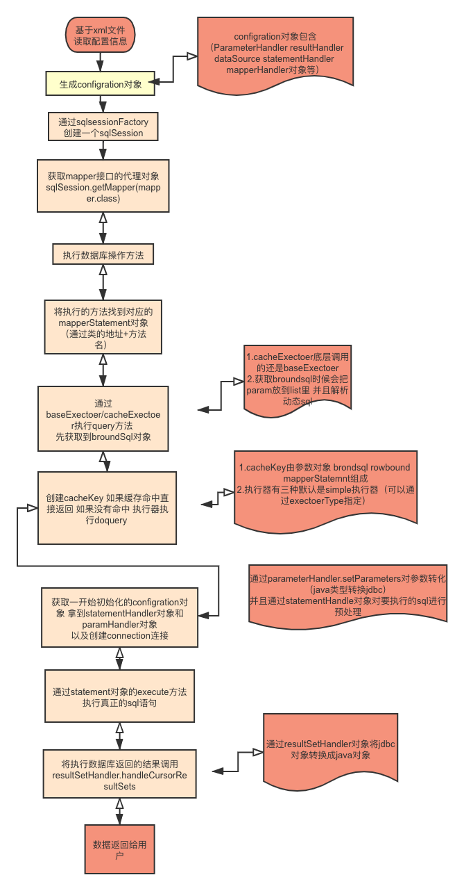

## mybatis
### 执行流程
1. mapper.xml中的配置⽂件⾥的每条sql语句，每一个\<select\>、\<insert\>、\<update\>、\<delete\>标签，都会被解析为带有Id信息的一个个MappedStatement对象，再通过⼀个HashMap集合保存起来。
2. Mapper接口是没有实现类的，当调用接口方法时，接口全限名+方法名拼接字符串作为 key 值，可唯一定位一个MappedStatement。
3. 执⾏getMapper()⽅法，判断是否注册过mapper接⼝，注册了就会使⽤mapperProxyFactory去⽣成代理类MapperProxy执⾏⽬标⽅法时，会调⽤MapperProxy代理类的invoke()⽅法
4. 此时会使用boundSql和对应的mapperStatement构造cacheKey,先进行缓存查询，命中直接返回。缓存Map\<Method, MapperMethodInvoker\> methodCache =  
5. 缓存无命中,则创建connect连接，通过statement对象执行execute方法。
6. 执⾏execute()⽅法返回结果使用resultSetHandler进行结果集的封装，添加到缓存中，最后返回结果。

### mybatis与Hibernate区别
1. 编写sql方面：hibernate不需要自己写sql语句，只需要写hql语句。而mybatis需要自己在配置文件中写sql语句，对开发人员的sql要求较高。
2. sql优化方面：由于hibernate自动生成sql语句，生成的语句开发人员不易优化。而mybatis的sql完全体现在配置文件中，就便于优化。
3. 数据库迁移方面：由于hibernate的sql是自动生成的，会根据不同的数据库生成对应的语法，迁移性较高。而mybatis的因为都是写在配置文件，迁移数据库，就可能造成语法不支持的情况。
4. 日志方面：hibernate拥有完整的日志系统，包括：sql记录、关系异常、优化警告、缓存提示、脏数据警告等。而mybatis仅有基本的记录功能。
5. 缓存方面：hibernate有更好的二级缓存机制，可以使用第三方缓存。而mybatis支持两级缓存，实际应用中应用性不高。
    - mybatis一级缓存sqlSession级的缓存。二级缓存Mapper级别的缓存。
    - hibernate一级缓存session级别的。Hibernate二级缓存是SessionFactory级的缓存。 SessionFactory的缓存分为内置缓存和外置缓存

### mybatis的一二级缓存
一级缓存的作用域是SQlSession, Mabits默认开启一级缓存。 在同一个SqlSession中，执行相同的SQL查询时；第一次会去查询数据库，并写在缓存中，第二次会直接从缓存中取。 当执行SQL时候两次查询中间发生了增删改的操作，则SQLSession的缓存会被清空。

