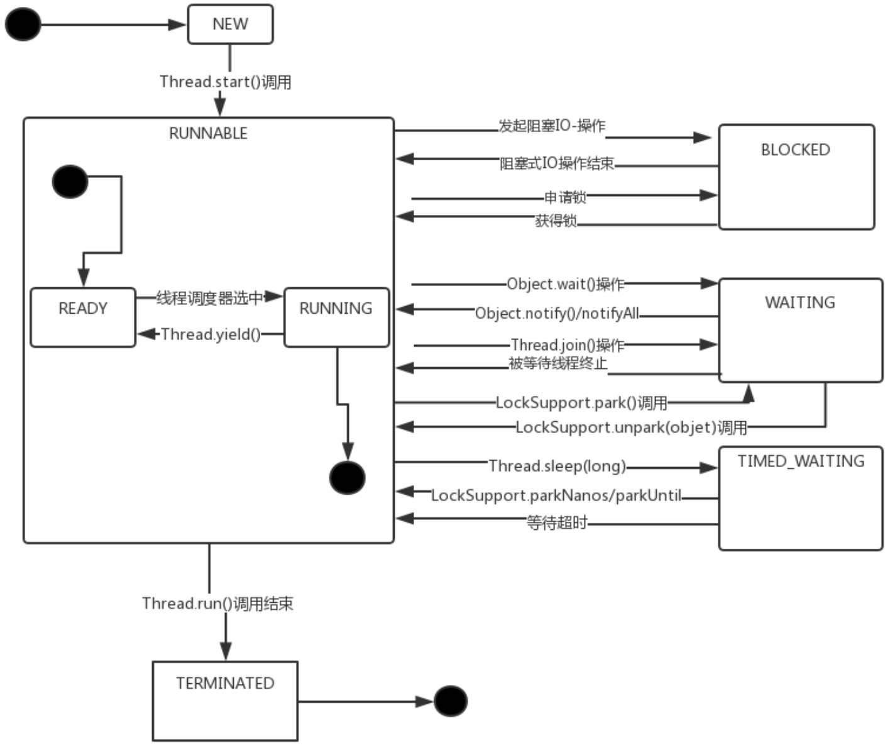
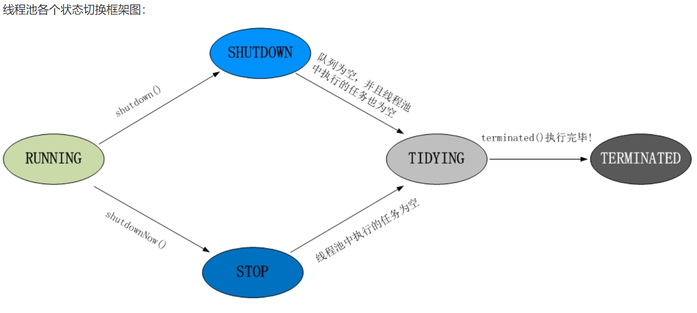
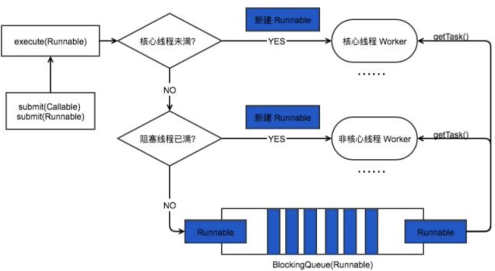

# 线程

## 线程状态

| 状态名称 | 说明 |
| --- |:---: |
| NEW | 创建但是未启动的线程则处于该状态。 |
| RUNNABLE | 该状态是一个复合状态。它包括两个子状态：READY和RUNNING。READY表示该状态的线程可以被线程调度器（Scheduler）进行调度而使之处于RUNNNING状态。而RUNNING表示该线程正在处于运行，即调用线程中的run()方法中定义的一些处理逻辑。 |
| BLOCKED | 一个线程发起一个`阻塞式I/O（Blocking I/O, 如read：当在数据没有到达前，read 会挂起，进程会卡住）操作`后，或者`申请一个由其他线程持有的独占资源（比如锁）`时，相应的线程会处于该状态。 |
| WAITING | 一个线程执行了某些特定方法之后就会处于这种`等待其他线程执行另外一些特定操作的状态`。 |
| TIME_WAITING | 和WAITING类似，差别在于处于该状态的线程并非无限制地等待其他线程执行特定操作，而是`处于带有时间限制的等待状态`。当其他线程没有在指定时间内执行该线程所期望的特定操作时，该线程的状态自然切换成RUNNABLE状态。 |
| TERMINATED | 已经执行结束的线程处于该状态。由于一个线程实例只能够被启动一次，所以一个线程也只能有一次该状态。Thread.run()正常返回或者由于抛出异常而提前终止都会导致线程处于该状态。 |



## 创建一个线程的开销

JVM 为创建线程所做的事：

1. 它为一个`线程栈分配内存`，该栈为每个线程方法调用保存一个栈帧
2. 每一栈帧由一个局部变量数组、返回值、操作数堆栈和常量池组成
3. 一些支持本机方法的 jvm 也会分配一个本机堆栈
4. 每个线程获得一个`程序计数器`，告诉它当前处理器执行的指令是什么
5. 系统创建一个与Java线程对应的本机线程
6. 将与线程相关的描述符添加到JVM内部数据结构中
7. 线程共享堆和方法区域

用数据来说明创建一个线程（即便不干什么）需要多大空间呢？答案是大约 1M 左右

## 线程方法与状态切换

sleep 导致当前线程休眠，与 wait 方法不同的是 sleep 不会释放当前占有的锁,sleep(long)会导致线程进入 TIMED-WATING 状态，而 wait()方法会导致当前线程进入 WATING 状态

1. wait 方法，主动让出锁。
    - 不带时间常数的wait 方法进入WAITING状态。
    - 带时间常数的wait 进入TIME-WAITING状态。
2. yield 方法，线程让步。
    - yield 会使当前线程让出 CPU 执行时间片，与其他线程一起重新竞争 CPU 时间片。一般情况下，优先级高的线程有更大的可能性成功竞争得到 CPU 时间片
3. join方法，当前线程转为阻塞状态，等到另一个线程结束，当前线程再由阻塞状态变为就绪状态，等待 cpu 的宠幸。
    - join方法可用于多线程的协作，如主子线程的协作，主线程等待子线程完成任务。
        - join 方法的状态转换与wait方法相同，带时间的进入TIME-WAITING状态，不带时间的进入WAITING状态。

## 创建线程的方式

1. FutureTask类 类似于Thread类，最后执行调用都要使用Thread类。`继承Thread`。
    `Thread 类本质上是实现了 Runnable 接口的一个实例`，代表一个线程的实例。启动线程的唯一方 法就是通过 Thread 类的 start()实例方法。start()方法是一个 native 方法，它将启动一个新线程，并执行 run()方法。

    ```java
    public class MyThread extends Thread {
        public void run() {
        } 
    }
    System.out.println("MyThread.run()");
    MyThread myThread1 = new MyThread();
    myThread1.start();
    ```

2. 实现`Runnable接口`  
    如果自己的类已经 extends 另一个类，就无法直接 extends Thread，此时，可以实现一个 Runnable 接口。

    ```java
    public class MyThread extends OtherClass implements Runnable {
        public void run() {
        } 
    }
    // 启动 MyThread，需要首先实例化一个 Thread，并传入自己的 MyThread 实例:
    MyThread myThread = new MyThread();
    Thread thread = new Thread(myThread);
    thread.start();

    // 事实上，当传入一个 Runnable target 参数给 Thread 后，Thread 的 run()方法就会调用
    public void run() {
        if (target != null) {
            target.run()
        } 
    }
    ```

3. `callable 接口实现`：可以获取线程的`返回值`，并且可以`抛出异常`。执行 Callable 方式，需要 FutureTask 实现类的支持，用于接收运算结果。  FutureTask 是  Future 接口的实现类。

    ```java
    // 实现callable方法
    class ThreadDemo implements Callable<Integer> {

        // 重写 call 方法，可以有返回值
        @Override
        public Integer call() throws Exception {
            int sum = 0;
    
            for (int i = 0; i <= 100000; i++) {
                sum += i;
            }
            return sum;
        }
    }

    public class TestCallable {
    
        public static void main(String[] args) {
            // 0.获取一个实例对象
            ThreadDemo td = new ThreadDemo();
    
            // 1.执行 Callable 方式，需要 FutureTask 实现类的支持，用于接收运算结果。
            FutureTask<Integer> result = new FutureTask<>(td);
    
            new Thread(result).start();
    
            // 2.接收线程运算后的结果
            try {
                // 通过 futureTask的get方法获取执行结果
                // FutureTask 可用于闭锁， 类似于CountDownLatch的作用，在所有的线程没有执行完成之后这里是不会执行的
                Integer sum = result.get();
                System.out.println(sum);
            // 同时可以抛出异常
            } catch (InterruptedException | ExecutionException e) {
                e.printStackTrace();
            }
        }
    }
    ```

4. 基于线程池的方式。  
    线程和数据库连接这些资源都是非常宝贵的资源。那么每次需要的时候创建，不需要的时候销毁，是非常浪费资源的。那么我们就可以使用缓存的策略，也就是使用线程池。

    ```java
    // 创建线程池
    ExecutorService threadPool = Executors.newFixedThreadPool(10);
    while(true) {
        threadPool.execute(new Runnable() { // 提交多个线程任务，并执行
            @Override
            public void run() {
                System.out.println(Thread.currentThread().getName() + " is running ..");
                try {
                    Thread.sleep(3000);
                } catch (InterruptedException e) {
                    e.printStackTrace();
                }
            }
        });
    }
    ```

## Callable和Runnable

1. Callable规定的方法是call()，而Runnable规定的方法是run()。
2. Callable的任务执行后`可返回值`，而Runnable的任务是不能返回值的。
3. call()方法`可抛出异常`，而run()方法是不能抛出异常的。
4. 运行Callable任务可拿到一个`Future对象`：
    - Future 表示异步计算的结果。它提供了检查计算是否完成的方法，以等待计算的完成，并`检索计算的结果`。
    - 通过Future对象可了解任务执行情况，`可取消任务的执行，还可获取任务执行的结果`。


## 线程池状态

线程池的5种状态：Running、ShutDown、Stop、Tidying、Terminated。


|状态|状态说明|状态切换|
|--|--|--|
|RUNNING|线程池处在RUNNING状态时，能够接收新任务，以及对已添加的任务进行处理。|线程池的初始化状态是RUNNING。换句话说，线程池被一旦被创建，就处于RUNNING状态|
|SHUTDOWN|线程池处在SHUTDOWN状态时，不接收新任务，但能处理已添加的任务。|调用线程池的shutdown()接口时，线程池由RUNNING -> SHUTDOWN。|
|STOP|线程池处在STOP状态时，不接收新任务，不处理已添加的任务，并且会中断正在处理的任务。|调用线程池的shutdownNow()接口时，线程池由(RUNNING or SHUTDOWN ) -> STOP。|
|TIDYING|当所有的任务已终止，ctl记录的”任务数量”为0，线程池会变为TIDYING状态。当线程池变为TIDYING状态时，会执行钩子函数terminated()。terminated()在ThreadPoolExecutor类中是空的，若用户想在线程池变为TIDYING时，进行相应的处理；可以通过重载terminated()函数来实现。|当线程池在SHUTDOWN状态下，阻塞队列为空并且线程池中执行的任务也为空时，就会由 SHUTDOWN -> TIDYING。|
|TERMINATED|线程池彻底终止，就变成TERMINATED状态。|线程池处在TIDYING状态时，执行完terminated()之后，就会由 TIDYING -> TERMINATED当线程池在STOP状态下，线程池中执行的任务为空时，就会由STOP -> TIDYING。|

### 线程池的组成

一般的线程池主要分为以下 4 个组成部分:

1. `线程池管理器(ThreadPoolExecutor)`:用于创建并管理线程池;
2. `工作线程`:线程池中的线程;
3. `任务接口`:每个任务必须实现的接口，用于工作线程调度其运行;
4. `任务队列`:用于存放待处理的任务，提供一种缓冲机制;

ThreadPoolExecutor 的构造方法如下:

```JAVA
public ThreadPoolExecutor(int corePoolSize,
                        int maximumPoolSize, 
                        long keepAliveTime, 
                        TimeUnit unit, 
                        BlockingQueue<Runnable> workQueue) {
    this(corePoolSize, maximumPoolSize, keepAliveTime, unit, workQueue, Executors.defaultThreadFactory(), defaultHandler);
}
```

1. corePoolSize:指定了线程池中的线程数量。
2. maximumPoolSize:指定了线程池中的最大线程数量。
3. keepAliveTime:当前线程池数量超过 corePoolSize 时，多余的空闲线程的存活时间，即多少时间内会被销毁。
4. unit:keepAliveTime 的单位。
5. workQueue:任务队列，被提交但尚未被执行的任务。
6. threadFactory:线程工厂，用于创建线程，一般用默认的即可。
7. handler:拒绝策略，当任务太多来不及处理，如何拒绝任务。

## Java 线程池工作过程

1. 线程池刚创建时，里面没有一个线程。任务队列是作为参数传进来的。不过，就算队列里面
有任务，线程池也不会马上执行它们。
2. 当调用 execute() 方法添加一个任务时，线程池会做如下判断:
    - 如果正在运行的线程数量小于 corePoolSize，那么马上创建线程运行这个任务;
    - 如果正在运行的线程数量大于或等于 corePoolSize，那么将这个任务放入队列;
    - 如果这时候队列满了，而且正在运行的线程数量小于 maximumPoolSize，那么还是要
创建非核心线程立刻运行这个任务;
    - 如果队列满了，而且正在运行的线程数量大于或等于 maximumPoolSize，那么线程池
会抛出异常 RejectExecutionException。
3. 当一个线程完成任务时，它会从队列中取下一个任务来执行。
4. 当一个线程无事可做，超过一定的时间(keepAliveTime)时，线程池会判断，如果当前运行的线程数大于 corePoolSize，那么这个线程就被停掉。所以线程池的所有任务完成后，它
最终会收缩到 corePoolSize 的大小。



## ThreadLocal

ThreadLocal，很多地方叫做线程本地变量，也有些地方叫做线程本地存储，ThreadLocal 的作用是`提供线程内的局部变量`，这种变量在线程的生命周期内起作用，减少同一个线程内多个函数或者组件之间一些公共变量的传递的复杂度。

ThreadLocalMap(线程的一个属性)

1. 每个线程中都有一个自己的 ThreadLocalMap 类对象，可以将线程自己的对象保持到其中，各管各的，线程可以正确的访问到自己的对象。
2. 将一个共用的 ThreadLocal 静态实例作为 key，将不同对象的引用保存到不同线程的
ThreadLocalMap 中，然后在线程执行的各处通过这个静态 ThreadLocal 实例的 get()方法取
得自己线程保存的那个对象，避免了将这个对象作为参数传递的麻烦。
3. ThreadLocalMap 其实就是线程里面的一个属性，它在 Thread 类中定义`ThreadLocal.ThreadLocalMap threadLocals = null;`

```java
private static final ThreadLocal threadSession = new ThreadLocal();

public static Session getSession() throws InfrastructureException {
        Session s = (Session) threadSession.get();
        try {
            if (s == null) {
                s = getSessionFactory().openSession();
            }
        }
        return s;
    }
```

## 进程调度算法

1. 优先调度算法
   1. 先来先服务调度算法(FCFS):当在作业调度中采用该算法时，每次调度都是从后备作业队列中选择一个或多个最先进入该队列的作业，将它们调入内存，为它们分配资源、创建进程，然后放入就绪队列。在进程调度中采用 FCFS 算法时，则`每次调度是从就绪队列中选择一个最先进入该队列的进程`，为之分配处理机，使之投入运行。该进程一直运行到完成或发生某事件而阻塞后才放弃处理机
      - 特点是:算法比较简单，可以实现基本上的公平。
   2. 短作业(进程)优先调度算法(SJF):短作业优先(SJF)的调度算法是从后备队列中选择一个或若干个估计运行时间最短的作业，将它们调入内存运行。而短进程优先(SPF)调度算法则是`从就绪队列中选出一个估计运行时间最短的进程`，将处理机分配给它，使它立即执行并一直执行到完成，或发生某事件而被阻塞放弃处理机时再重新调度。该算法未照顾紧迫型作业。
2. 高优先权优先调度算法
    1. 非抢占式优先权算法:系统一旦`把处理机分配给就绪队列中优先权最高的进程`后，该进程便`一直执行下去，直至完成`;或因发生某事件使该进程放弃处理机时。这种调度算法主要用于批处理系统中;也可用于某些`对实时性要求不严的实时系统中`。
    2. 抢占式优先权调度算法:在这种方式下，系统同样是`把处理机分配给优先权最高的进程`，使之执行。但在其执行期间，`只要又出现了另一个其优先权更高的进程，进程调度程序就立即停止当前进程(原优先权最高的进程)的执行，重新将处理机分配给新到的优先权最高的进程`。显然，这种抢占式的优先权调度算法能更好地满足紧迫作业的要求，故而`常用于要求比较严格的实时系统中，以及对性能要求较高的批处理和分时系统中`。
3. 基于时间片的轮转调度算法
    1. 时间片轮转法:在早期的时间片轮转法中，系统`将所有的就绪进程按先来先服务的原则排成一个队列`，每次调度时，把 CPU 分配给队首进程，并令其执行一个时间片。时间片的大小从几 ms 到几百 ms。当执行的时间片用完时，由一个计时器发出时钟中断请求，调度程序便据此信号来停止该进程的执行并将它送往就绪队列的末尾;然后，再把处理机分配给就绪队列中新的队首进程，同时也让它执行一个时间片。这样就可以`保证就绪队列中的所有进程在一给定的时间内均能获得一时间片的处理机执行时间`。
    2. 多级反馈队列调度算法
