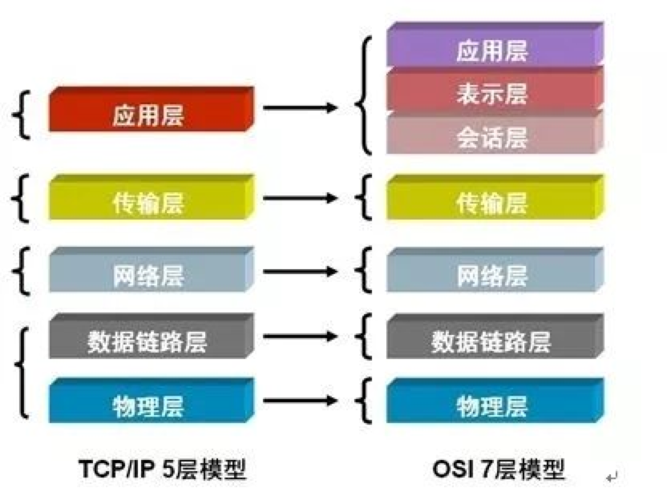
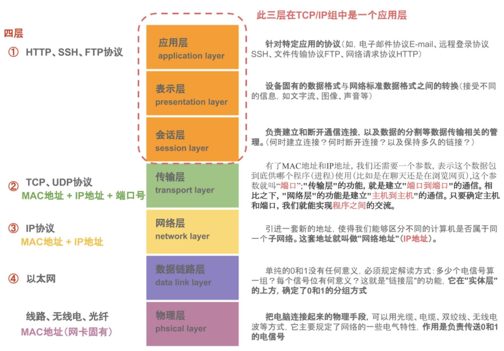
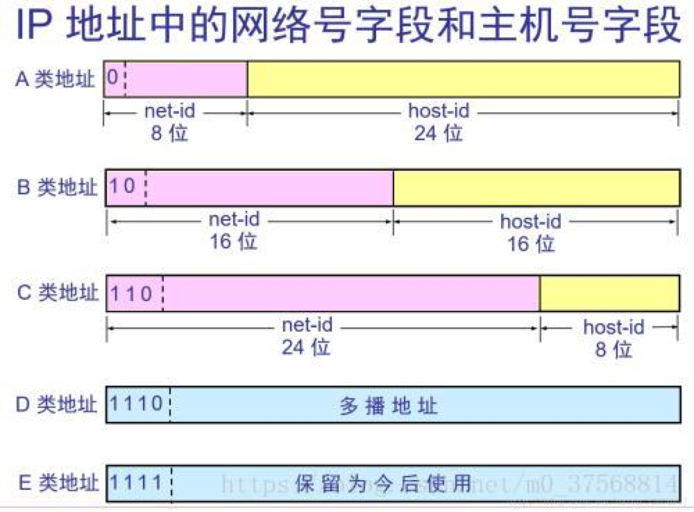
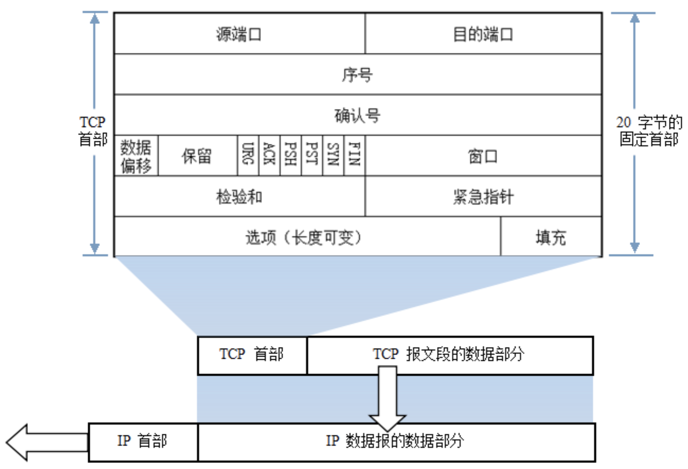
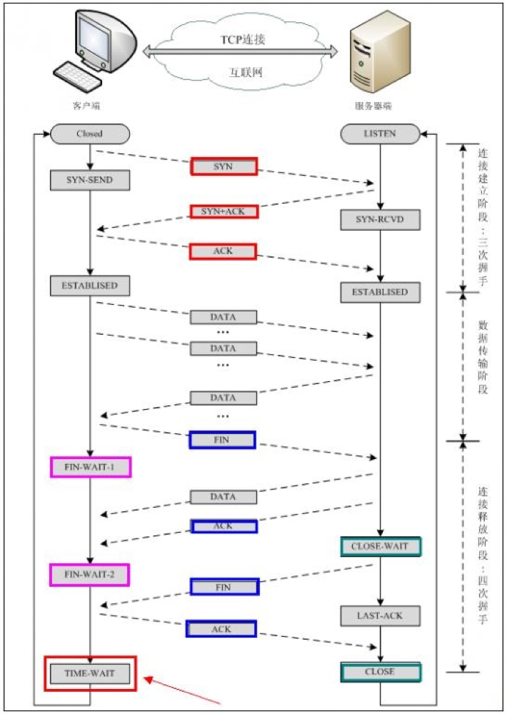

# network

## 模型

|5层|7层|功能|主要设备|主要协议|单位|
|--:|--|--|--|--|--|
|物理层|物理层|设备之间比特流的传输，物理接口，电气特性等等。通过硬件设备将模拟信号转换为数字信号,有了0/1数据流，叫做`比特流`。实实在在的物理链路，负责将数据以比特流的方式发送、接收|集线器、中继器,电缆，发送器，接收器|V.35、EIA/TIA-232|比特流|
|数据链路层|数据链路层|可以发比特流但是没有格式就会乱七八糟，于是就有了”`帧`”。负责准备物理传输，CRC校验，错误通知，网络拓扑，流控等|交换机、网桥、网卡|802.2、802.3ATM、HDLC|帧|
|网络层|网络层|IP选址和路由转发。负责管理网络地址，定位设备，决定路由。前两层都是在于可以发数据，以及发的数据是否正确，然而如果连着两台电脑还行，多台电脑而又只想让其中一台可以通信，则需要路由。选择性的发，那每台电脑就得有自己的身份，于是出现了IP协议等。|路由器，网桥路由器|IP(IPV4、IPV6) ICMP|数据包（报文）|
|传输层|传输层|负责分割、组合数据，实现端到端的逻辑连接，确定传输的可靠性以及每种协议的端口号，传输前的错误检测，流控。建立、管理、维护端到端的连接。传输层有两个重要的协议：TCP和UDP。(TCP效率低但是发送包会校验是否完整，UDP效率高但是不管别人能否完整收到。)|网关|TCP UDP|数据段TPDU|
|｜-|会话层|负责建立、维护、控制会话单工(Simplex)、半双工(Half duplex)、全双工(Full duplex)三种通信模式的服务。计算机收到了发送的数据，但是有那么多进程，具体哪个进程需要用到这个数据，则把他输送到那个进程。例如：如果80端口要用，所以系统内数据通信，将接收端口数据`送至需求端口`。对应用会话的管理，同步。确定网络数据是否要经过远程会话。|网关|FTP SSH TLS HTTP(S) SQL|数据流SPDU|
|应用层｜-|表示层|负责数据的编码、转化、数据压缩、解压，加密、解密。根据不同应用目的处理为不同的格式，表现出来就是我们看到的各种各样的文件扩展名。就是一个沟通的桥梁来整理，还原出原本应该有的表示，类似于一个`拆快递`的过程。|网关|CSS GIF HTML JSON XML GIF|数据流PPDU|
|｜-|应用层|`是其他层对用户的已经封装好的接口`，提供多种服务，用户只需操作应用层就可以得到服务内容，这样封装可以让更多的人能使用它。确定通信对象，提供访问网络服务的接口|网关|Telnet、FTP、HTTP、SNMP等|数据流APDU|

## TCP/IP 协议

TCP/IP 是基于 TCP 和 IP 这两个最初的协议之上的不同的通信协议的大集合。

|协议名称|中文名称|说明|
|---:|---|---|
|TCP|传输控制协议(Transmission Control Protocol)|TCP 用于从应用程序到网络的数据传输控制。TCP 负责在数据传送之前将它们分割为IP包，然后在它们到达的时候将它们重组。|
|IP|网际协议（Internet Protocol）|IP 负责计算机之间的通信。IP 负责在因特网上发送和接收数据包。|
|HTTP|超文本传输协议(Hyper Text Transfer Protocol)|HTTP 负责 web 服务器与 web 浏览器之间的通信。HTTP 用于从 web 客户端（浏览器）向 web 服务器发送请求，并从 web 服务器向 web 客户端返回内容（网页）。|
|HTTPS|安全的 HTTP（HTTP Secure）|HTTPS 负责在 web 服务器和 web 浏览器之间的安全通信。作为有代表性的应用，HTTPS 会用于处理信用卡交易和其他的敏感数据。|
|SSL|安全套接字层（Secure Sockets Layer）|SSL 协议用于为安全数据传输加密数据。|
|SMTP|简易邮件传输协议（Simple Mail Transfer Protocol）|SMTP 用于电子邮件的传输。|
|FTP|文件传输协议（File Transfer Protocol）|FTP 负责计算机之间的文件传输。|
|NTP|网络时间协议（Network Time Protocol）|NTP 用于在计算机之间同步时间（钟）。|
|DHCP|动态主机配置协议（Dynamic Host Configuration Protocol）|DHCP 用于向网络中的计算机分配动态 IP 地址。|
|ICMP|因特网消息控制协议（Internet Control Message Protocol）|ICMP 负责网络中的错误处理。|
|ARP|地址解析协议（Address Resolution Protocol）|ARP|用于通过 IP 来查找基于 IP 地址的计算机网卡的硬件地址。|
|RARP|反向地址转换协议（Reverse Address Resolution Protocol）|RARP 用于通过 IP 查找基于硬件地址的计算机网卡的 IP 地址。|
|PPTP|点对点隧道协议（Point to Point Tunneling Protocol）|PPTP 用于私人网络之间的连接（隧道）。|

## 计算机网络的性能指标

- 速率：连接在计算机网络上的主机在数字信道上传送数据的速率，也称为`数据率或比特率`。

- 带宽：网络的`通信线路传送数据的能力`。即：在单位时间内从网络中的某一个点到另一点所能通过的“最高数据率”。

- 吞吐量：在`单位时间内通过某个网络（信道/接口）的数据量`。

- 时延：数据（一个报文或分组，甚至比特）从网络（或链路）的`一端传送到另一端所需的时间`。

  - 发送时延：主机或路由器`发送数据帧所需要的时间`，即：从发送数据帧的第一个比特算起到该帧的最后一个比特发送完毕所需要的时间。
  - 传播时延：电磁波在信道中传播一定的距离需要花费的时间。
  - 处理时延：主机或路由器在收到分组时要花费一定的时间进行处理。例如：分析分组的首部信息、从分组中提取数据部分、进行差错检验或查找适当的路由等等。

    排队时延：分组在经过网络传输时，要经过许多路由器。但分组在进入路由器后要先在输入队列中排队等待处理。

- 时延带宽积:传播时延*带宽

- 往返时间RTT：从发送方发送数据开始，到发送方收到来自接收方的确认总共经历的时间。

- 利用率：信道利用率和网络利用率两种。

## 数据链路层

1. 封装成帧：数据部分长度上限---MTU，最大传输单元（Maximum Transmission Unit，MTU）
    就是在一段数据的前后分别添加首部和尾部，这样就构成了一个帧。

2. 透明传输：用字节填充或字符填充解决透明传输问题。
    `不管什么字符都可以放在帧中传输过去，这样的传输就是透明传输`。解决透明传输的问题方法是：发送端的数据链路层在数据中出现控制字符"SOH"或"EOH"的前面插入一个转义字符"ESC"，而在接收端的数据链路层在将数据送往网络层之前删除这个插入的转义字符。

3. 差错检测：CRC循环冗余校验。
    CRC运算实际上就是在数据长为k的后面添加供差错检测用的n位冗余码，然后构成帧k+n位发送出去。
    采用的是循环冗余检验（CRC:Cyclic Redundancy Check)的差错检查技术，如果仅仅使用CRC，则只能做到对帧的无差错接收，即接收的帧在传输的过程中没有产生差错，并没有要求数据链路层向网络层提供“可靠传输”的服务。

## 同步通信与异步通信

`同步通信`：通信双方必须`先建立同步`，即双方的`时钟要调整到同一个频率`。收发双方不停地发送和接收连续的同步比特流。

`异步通信`：异步通信在发送字符时，`所发送的字符之间的时间间隔可以是任意的`。当然，接收端必须时刻做好接收的准备。发送端可以在任意时刻开始发送字符，因此必须在每一个字符的开始和结束的地方加上标志，即加上开始位和停止位，以便使接收端能够正确地将每一个字符接收下来。异步通信的好处是通信设备简单、便宜，但`传输效率较低（因为开始位和停止位的开销所占比例较大）`。

## IP地址

现在的IP网络使用32位地址，以点分十进制表示，如172.16.0.0。地址格式为：`IP地址=网络地址＋主机地址` 或 IP地址=`主机地址＋子网地址＋主机地址`。

IP地址类型：最初设计互联网络时，为了便于寻址以及层次化构造网络，每个IP地址包括两个标识码（ID），即网络ID和主机ID。同一个物理网络上的所有主机都使用同一个网络ID，网络上的一个主机（包括网络上工作站，服务器和路由器等）有一个主机ID与其对应。IP地址根据网络ID的不同分为5种类型，A类地址、B类地址、C类地址、D类地址和E类地址。

   1. A类IP地址：一个A类IP地址由1字节的网络地址和3字节主机地址组成，网络地址的最高位必须是“0”， 地址范围从1.0.0.0 到126.0.0.0。可用的A类网络有126个，每个网络能容纳1亿多个主机。  
   2. B类IP地址:一个B类IP地址由2个字节的网络地址和2个字节的主机地址组成，网络地址的最高位必须是“10”，地址范围从128.0.0.0到191.255.255.255。可用的B类网络有16382个，每个网络能容纳6万多个主机 。
   3. C类IP地址：一个C类IP地址由3字节的网络地址和1字节的主机地址组成，网络地址的最高位必须是“110”。范围从192.0.0.0到223.255.255.255。C类网络可达209万余个，每个网络能容纳254个主机。
   4. D类地址：用于多点广播（Multicast）。 D类IP地址第一个字节以“lll0”开始，它是一个专门保留的地址。它并不指向特定的网络，目前这一类地址被用在多点广播（Multicast）中。多点广播地址用来一次寻址一组计算机，它标识共享同一协议的一组计算机。224.0.0.0到239.255.255.255用于多点广播 。
   5. E类IP地址：以“11110”开始，为将来使用保留。240.0.0.0到255.255.255.254，255.255.255.255用于广播地址:
      - 全零（“0．0．0．0”）地址对应于当前主机。全“1”的IP地址（“255．255．255．255”）是当前子网的广播地址。
      - 在IP地址3种主要类型里，各保留了3个区域作为私有地址，其地址范围如下： A类地址：10.0.0.0～10.255.255.255 B类地址：172.16.0.0～172.31.255.255 C类地址：192.168.0.0～192.168.255.255

|网络类型|最大可指派网络数|网络号范围|最大主机数|
|--|--|--|--|
|A|126=${2^7}$-2|1～126|16777215=${2^{24}}$|
|B|16383=${2^{14}}$-2|128.1~191.255|65534=${2^{16}}$|
|C|2097151=${2^{21}}$-1|192.0.1~223.255.255|254

## 子网掩码及网络划分

随着互连网应用的不断扩大，原先的IPv4的弊端也逐渐暴露出来，即网络号占位太多，而主机号位太少，所以其能提供的主机地址也越来越稀缺，目前除了使用NAT在企业内部利用保留地址自行分配以外，通常都`对一个高类别的IP地址进行再划分，以形成多个子网，提供给不同规模的用户群使用`。

这里主要是为了在网络分段情况下有效地利用IP地址，通过对主机号的高位部分取作为子网号，从通常的网络位界限中扩展或压缩子网掩码，用来创建某类地址的更多子网。但创建更多的子网时，在每个子网上的可用主机地址数目会比原先减少。

### 子网掩码

`子网掩码是标志两个IP地址是否同属于一个子网的`，也是32位二进制地址，其`每一个为1代表该位是网络位，为0代表主机位`。它和IP地址一样也是使用点式十进制来表示的。如果两个IP地址在子网掩码的按位与的计算下所得结果相同，即表明它们共属于同一子网中。

在计算子网掩码时，我们要注意IP地址中的保留地址，即" 0"地址和广播地址，它们是指主机地址或网络地址全为" 0"或" 1"时的IP地址，它们代表着本网络地址和广播地址，一般是不能被计算在内的。

子网掩码的计算：

- 对于`无须再划分成子网的IP地址`来说，其子网掩码非常简单，即按照其定义即可写出：如某B`类IP地址`为 10.12.3.0，无须再分割子网，则该IP地址的子网掩码`255.255.0.0`。如果它是一个`C类地址`，则其子网掩码为 `255.255.255.0`。其它类推，不再详述。下面我们关键要介绍的是

一个IP地址，还需要将其高位主机位再作为划分出的子网网络号，剩下的是每个子网的主机号，每个子网的掩码计算:

1. 利用子网数来计算
    在求子网掩码之前必须先搞清楚要划分的子网数目，以及每个子网内的所需主机数目。
    - 将子网数目转化为二进制来表示;
    如欲将B类IP地址168.195.0.0划分成27个子网：27=11011；
    - 取得该二进制的位数，为N；
    该二进制为五位数，N = 5
    - 取得该IP地址的类子网掩码，将其主机地址部分的的前N位置1即得出该IP地址划分子网的子网掩码。
    将B类地址的子网掩码255.255.0.0的主机地址前5位置 1，得到 255.255.248.0

2. 利用主机数来计算
    如欲将B类IP地址168.195.0.0划分成若干子网，每个子网内有主机700台：
    - 将主机数目转化为二进制来表示；
    700=1010111100
    - 如果主机数小于或等于254（注意去掉保留的两个IP地址），则取得该主机的二进制位数，为N，这里肯定 N<8。如果大于254，则 N>8，这就是说主机地址将占据不止8位；
    该二进制为十位数，N=10；
    - 使用255.255.255.255来将该类IP地址的主机地址位数全部置1，然后从后向前的将N位全部置为 0，即为子网掩码值。
    将该B类地址的子网掩码255.255.0.0的主机地址全部置1，得到255.255.255.255，然后再从后向前将后 10位置0,即为：11111111.11111111.11111100.00000000，即255.255.252.0。这就是该欲划分成主机为700台的B类IP地址 168.195.0.0的子网掩码。

3. 要你根据每个网络的主机数量进行子网地址的规划和计算子网掩码。这也可按上述原则进行计算。
    比如一个子网有10台主机，那么对于这个子网需要的IP地址是：
        10＋1＋1＋1＝13
    注意：加的第一个1是指这个网络连接时所需的`网关地址`，接着的两个1分别是指`网络地址和广播地址`。
    因为13小于16（16等于2的4次方），所以主机位为4位。而256－16＝240，所以该子网掩码为255.255.255.240。
    如果一个子网有14台主机，不少人常犯的错误是：依然分配具有16个地址空间的子网，而忘记了给网关分配地址。这样就错误了，因为14＋1＋1＋1＝17，17大于16，所以我们只能分配具有32个地址（32等于2的5次方）空间的子网。这时子网掩码为：255.255.255.224。

## ARP/RARP协议

`地址解析协议，即ARP（Address Resolution Protocol），是根据IP地址获取物理地址的一个TCP/IP协议`。主机发送信息时将`包含目标IP地址的ARP请求广播到网络上的所有主机`，并接收返回消息，以此确定目标的物理地址；收到返回消息后将该IP地址和物理地址存入本机ARP缓存中并保留一定时间，下次请求时直接查询ARP缓存以节约资源。地址解析协议是建立在网络中各个主机互相信任的基础上的，网络上的主机可以自主发送ARP应答消息，其他主机收到应答报文时不会检测该报文的真实性就会将其记入本机ARP缓存；由此攻击者就可以向某一主机发送伪ARP应答报文，使其发送的信息无法到达预期的主机或到达错误的主机，这就构成了一个ARP欺骗。ARP命令可用于查询本机ARP缓存中IP地址和MAC地址的对应关系、添加或删除静态对应关系等。

当主机A要与主机B通信时，地址解析协议可以将主机B的IP地址（192.168.1.2）解析成主机B的MAC地址，以下为工作流程：

1. 根据主机A上的路由表内容，IP确定用于访问主机B的转发IP地址是192.168.1.2。然后A主机`在自己的本地ARP缓存中检查主机B的匹配MAC地址`。
2. 如果主机A在ARP缓存中没有找到映射，它将询问192.168.1.2的硬件地址，从而`将ARP请求帧广播到本地网络上的所有主机`。源主机A的IP地址和MAC地址都包括在ARP请求中。本地网络上的每`台主机都接收到ARP请求并且检查是否与自己的IP地址匹配`。如果主机发现请求的IP地址与自己的IP地址不匹配，它将丢弃ARP请求。
3. `主机B确定ARP请求中的IP地址与自己的IP地址匹配，则将主机A的IP地址和MAC地址映射添加到本地ARP缓存中`。
4. 主机B将包含其MAC地址的`ARP回复消息直接发送回主机A`。
5. 当主机A收到从主机B发来的ARP回复消息时，会`用主机B的IP和MAC地址映射更新ARP缓存`。本机缓存是有生存期的，生存期结束后，将再次重复上面的过程。主机B的MAC地址一旦确定，主机A就能向主机B发送IP通信了。

逆地址解析协议，即RARP，功能和ARP协议相对，其将局域网中某个主机的`物理地址转换为IP地址`，比如局域网中有一台主机只知道物理地址而不知道IP地址，那么可以通过RARP协议发出征求自身IP地址的广播请求，然后由RARP服务器负责回答。

1. 给主机发送一个本地的RARP广播，在此广播包中，声明自己的MAC地址并且请求任何收到此请求的RARP服务器分配一个IP地址；
2. 本地网段上的`RARP服务器收到此请求后，检查其RARP列表，查找该MAC地址对应的IP地址`；
3. 如果存在，RARP服务器就给源主机发送一个响应数据包并将此IP地址提供给对方主机使用；
4. 如果不存在，RARP服务器对此不做任何的响应；

## TCP/IP

TCP/IP协议是Internet最基本的协议、Internet国际互联网络的基础，由`网络层的IP协议`和`传输层的TCP协议`组成。通俗而言：`TCP负责发现传输的问题`，一有问题就发出信号，要求重新传输，直到所有数据安全正确地传输到目的地。而`IP是给因特网的每一台联网设备规定一个地址`。

IP层接收由更低层（网络接口层例如以太网设备驱动程序）发来的数据包，并把该数据包发送到更高层---TCP或UDP层；相反，IP层也把从TCP或UDP层接收来的数据包传送到更低层。IP数据包是不可靠的，因为IP并没有做任何事情来确认数据包是否按顺序发送的或者有没有被破坏，IP数据包中含有发送它的主机的地址（源地址）和接收它的主机的地址（目的地址）。

TCP是面向连接的通信协议，通过三次握手建立连接，通讯完成时要拆除连接，由于TCP是面向连接的所以只能用于端到端的通讯。TCP提供的是一种可靠的数据流服务，采用"带重传的肯定确认"技术来实现传输的可靠性。TCP还采用一种称为"滑动窗口"的方式进行流量控制，所谓窗口实际表示接收能力，用以限制发送方的发送速度。

其中：SEQ:"sequance"序列号；ACK:"acknowledge"确认号；SYN:"synchronize"请求同步标志；ACK:"acknowledge"确认标志"；FIN："Finally"结束标志。

### TCP协议的三次握手和四次挥手

TCP连接建立过程：

- Client端发送连接请求报文；
- Server段接受连接后回复ACK报文，并为这次连接分配资源；
- Client端接收到ACK报文后也向Server段发送ACK报文，并分配资源，这样TCP连接就建立了。

TCP连接断开过程：

- 假设Client端发起中断连接请求，也就是发送FIN报文；
- Server端接到FIN报文后，意思是说"我Client端没有数据要发给你了"，但是如果你还有数据没有发送完成，则不必急着关闭Socket，可以继续发送数据。所以你先发送ACK，"告诉Client端，你的请求我收到了，但是我还没准备好，请继续你等我的消息"。这个时候Client端就进入FIN_WAIT状态，继续等待Server端的FIN报文；
- 当Server端确定数据已发送完成，则向Client端发送FIN报文，"告诉Client端，好了，我这边数据发完了，准备好关闭连接了"。Client端收到FIN报文后，"就知道可以关闭连接了，但是他还是不相信网络，怕Server端不知道要关闭，所以发送ACK后进入TIME_WAIT状态，如果Server端没有收到ACK则可以重传。"；
- Server端收到ACK后，"就知道可以断开连接了"。Client端等待了2MSL后依然没有收到回复，则证明Server端已正常关闭，那好，我Client端也可以关闭连接了。Ok，TCP连接就这样关闭了！

## UDP协议

UDP用户数据报协议，是面向无连接的通讯协议，UDP数据包括目的端口号和源端口号信息，由于通讯不需要连接，所以可以实现广播发送。`UDP通讯时不需要接收方确认，属于不可靠的传输`，可能会出现丢包现象，实际应用中要求程序员编程验证。

UDP与TCP位于同一层，但它不管数据包的顺序、错误或重发。因此，UDP不被应用于那些使用虚电路的面向连接的服务，`UDP主要用于那些面向查询---应答的服务，例如NFS。相对于FTP或Telnet`，这些服务需要交换的信息量较小。

每个UDP报文分UDP报头和UDP数据区两部分。报头由四个16位长（2字节）字段组成(4字段*2字节)，分别说明该报文的`源端口、目的端口、报文长度以及校验值`。
使用UDP协议包括：TFTP（简单文件传输协议）、SNMP（简单网络管理协议）、DNS（域名解析协议）、NFS、BOOTP。

## DNS协议

DNS是域名系统(Domain Name System)的缩写，该系统用于`命名组织到域层次结构中的计算机和网络服务`，可以简单地理解为将`URL转换为IP地址`。域名是由圆点分开一串单词或缩写组成的，每一个域名都对应一个惟一的IP地址，在Internet上域名与IP地址之间是一一对应的，DNS就是进行域名解析的服务器。DNS命名用于Internet等TCP/IP网络中，通过用户友好的名称查找计算机和服务。

## NAT协议

NAT网络地址转换(Network Address Translation)属接入广域网(WAN)技术，是一种`将私有（保留）地址转化为合法IP地址`的转换技术，它被广泛应用于各种类型Internet接入方式和各种类型的网络中。原因很简单，NAT不仅完美地`解决了lP地址不足`的问题，而且还能够`有效地避免来自网络外部的攻击`，`隐藏并保护网络内部的计算机`。

基本 NAT 是最简单的一种地址转换方式，它只对数据包的 `IP 层参数进行转换`，它可分为静态 NAT 和动态 NAT 。

- 静态 NAT 是公网 IP 地址和私有 IP 地址有一对一的关系，一个公网 IP 地址对应一个私有 IP 地址，建立和维护一张静态地址映射表。
- 动态 NAT 是公网 IP 地址和私有 IP 地址有一对多的关系，同一个公网 IP 地址分配给不同的私网用户使用，使用时间必须错开。它包含一个公有 IP 地址池和一张动态地址映射表。

## DHCP协议

DHCP动态主机设置协议（Dynamic Host Configuration Protocol）是一个`局域网的网络协议`，使用UDP协议工作，主要有两个用途：`给内部网络或网络服务供应商自动分配IP地址`，`给用户或者内部网络管理员作为对所有计算机作中央管理的手段`。指的是由服务器控制一段IP地址范围，客户机登录服务器时就可以自动获得服务器分配的IP地址和子网掩码。

## HTTP协议

超文本传输协议（HTTP，HyperText Transfer Protocol)是互联网上应用最为广泛的一种网络协议。所有的WWW文件都必须遵守这个标准。　　
HTTP协议包含的请求

- GET：请求读取由URL所标志的信息。
- POST：给服务器添加信息（如注释）。
- PUT：在给定的URL下存储一个文档。
- DELETE：删除给定的URL所标志的资源。

### POST 与 GET 的区别

1. Get是从服务器上获取数据，Post是向服务器传送数据。
2. Get是把参数数据队列加到提交表单的Action属性所指向的URL中，值和表单内各个字段一一对应，在URL中可以看到。
3. Get传送的数据量小，不能大于2KB；Post传送的数据量较大，一般被默认为不受限制。
4. 根据HTTP规范，GET用于信息获取，而且应该是安全的和幂等的。

   - 安全的: 意味着该操作用于获取信息而非修改信息。换句话说，GET请求一般不应产生副作用。就是说，它仅仅是获取资源信息，就像数据库查询一样，不会修改，增加数据，不会影响资源的状态。
   - 幂等的: 意味着对同一URL的多个请求应该返回同样的结果。
